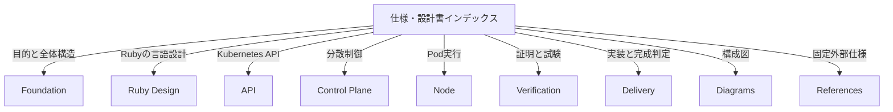

# Rubernetes仕様・設計書

> 対象読者: 利用者、実装者、検証者、運用者、審査者
>
> 版: 0.2
>
> **Status:** 実装基準ドラフト

Rubernetes は、Kubernetes v1.36.2 と外部観測上互換なLinuxコンテナオーケストレータを、
制御面からコンテナ実行・ネットワークまでRuby中心で独立実装するプロジェクトである。
このディレクトリが規範仕様と設計書の正本であり、入口は本ページとする。

## Documentation Map

## Reading Paths

| 読者 | 読む順序 |
|---|---|
| 全体像を知りたい | [目的と互換性](foundation/goals-and-compatibility.md) → [アーキテクチャ](foundation/architecture.md) → [全景図](diagrams/00-overview.md) |
| Rubyらしさを見たい | [Ruby Design](ruby/README.md) → [Schema Compiler](ruby/schema-compiler.md) → [Controller DSL](control-plane/controllers.md) |
| Kubernetes互換を実装する | [Kubernetes API](api/kubernetes-api.md) → [API Server](api/api-server.md) → [互換性試験](verification/testing.md) |
| コンテナ実行を実装する | [Node Agent](node/node-agent.md) → [Runtime](node/runtime.md) → [Network](node/network.md) → [Volume](node/volume.md) |
| 正しさを確認する | [形式仕様](verification/formal-methods.md) → [検証戦略](verification/testing.md) → [検証図](diagrams/08-verification.md) |
| 実装順と完成条件を確認する | [マイルストーン](delivery/milestones.md) → [実装計画](delivery/implementation-plan.md) → [Coding Standards](delivery/coding-standards.md) |
| repository構造を確認する | [Project Structure](delivery/project-structure.md) → [Architecture](foundation/architecture.md) |
| upstream testを導入する | [Kubernetes互換性試験](verification/kubernetes-compatibility.md) → [検証戦略](verification/testing.md) |

## Specification Families

| Family | 責務 | Index |
|---|---|---|
| Foundation | 文書規約、目的、互換境界、用語、全体構造、名称 | [foundation/](foundation/README.md) |
| Ruby Design | Manifest DSL、Schema DSL、metaprogramming生成境界 | [ruby/](ruby/README.md) |
| API | Kubernetes APIとAPI Server | [api/](api/README.md) |
| Control Plane | Store、Raft、Informer、Controller、Scheduler | [control-plane/](control-plane/README.md) |
| Node | Node Agent、Runtime、Network、Service Proxy、Volume | [node/](node/README.md) |
| Verification | TLA+、Lean、upstream Conformance/e2e、差分試験、障害注入、実機gate | [verification/](verification/README.md) |
| Delivery | milestone、repository構造、実装順、release gate、coding standard | [delivery/](delivery/README.md) |
| Diagrams | 00〜08の構成図 | [diagrams/](diagrams/README.md) |
| References | 固定する外部仕様と設計由来 | [references.md](references.md) |

## Normative Rules

- 本文中のMUST/MUST NOT/SHOULD/MAYと無印の規範文は[文書規約](foundation/document-conventions.md)に従う。
- 同一事項について本文と図が衝突した場合は本文を正とする。
- Kubernetes v1.36.2の外部観測可能な挙動と本文が衝突した場合は、明示したLinux platform境界を除き互換挙動を優先する。
- 仕様変更では、本文、図、machine-readable corpus、形式仕様、testを同じ変更単位で更新する。

## Complete Document Index

### Foundation

- [文書規約](foundation/document-conventions.md)
- [目的・互換性・規模](foundation/goals-and-compatibility.md)
- [用語集](foundation/glossary.md)
- [アーキテクチャ](foundation/architecture.md)
- [名称](foundation/naming.md)

### Ruby Design and API

- [Ruby Design Overview](ruby/README.md)
- [Ruby Manifest DSL](ruby/manifest-dsl.md)
- [Schema Compiler](ruby/schema-compiler.md)
- [Kubernetes API](api/kubernetes-api.md)
- [API Server](api/api-server.md)

### Control Plane and Node

- [Store](control-plane/store.md)
- [Raft](control-plane/raft.md)
- [Informer](control-plane/informer.md)
- [Controllers](control-plane/controllers.md)
- [Scheduler](control-plane/scheduler.md)
- [Node Agent](node/node-agent.md)
- [Runtime](node/runtime.md)
- [Network](node/network.md)
- [Service Proxy](node/service-proxy.md)
- [Volume](node/volume.md)

### Verification and Delivery

- [形式仕様](verification/formal-methods.md)
- [検証戦略](verification/testing.md)
- [Kubernetes互換性試験](verification/kubernetes-compatibility.md)
- [マイルストーンと完了証拠](delivery/milestones.md)
- [Project Structure](delivery/project-structure.md)
- [実装計画とrelease gate](delivery/implementation-plan.md)
- [Coding Standards](delivery/coding-standards.md)
- [規範参照](references.md)

### Diagrams

- [00 全景](diagrams/00-overview.md)
- [01 API Server](diagrams/01-api-server.md)
- [02 Storage / Raft](diagrams/02-storage-raft.md)
- [03 制御ループ](diagrams/03-control-loop.md)
- [04 Node Agent](diagrams/04-node-agent.md)
- [05 Runtime](diagrams/05-runtime.md)
- [06 Network](diagrams/06-network.md)
- [07 Storage / Volume](diagrams/07-storage-volume.md)
- [08 Verification](diagrams/08-verification.md)

## Related

- [ルート案内](../spec.md)
- [規範参照](references.md)
