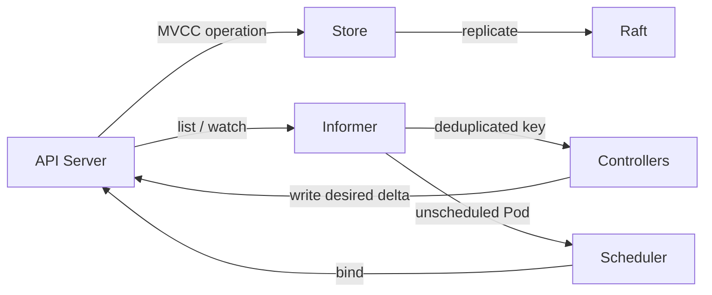

[仕様書の目次](../README.md)

# 制御面

> 対象読者: 分散システムの実装者、コントローラとスケジューラの実装者、形式検証の担当者

Ruby製の制御面を定義する。制御面は、APIが受理したdesired stateを永続化する。そのうえで、watchのイベントをもとにコントローラとスケジューラを動かし、actual stateをdesired stateに収束させる。

## コンポーネント間の流れ

## Documents

| 文書 | 内容 |
|---|---|
| [Store](store.md) | MVCC、revision、watch history、transaction |
| [Raft](raft.md) | election、WAL、commit、snapshot、membership |
| [Informer](informer.md) | Reflector、DeltaFIFO、Indexer、WorkQueue |
| [Controllers](controllers.md) | reconcile規約、built-in controller、Controller DSL |
| [Scheduler](scheduler.md) | Filter、Score、Bind、Preemption、plugin DSL |

## Related

- [Control Loop図](../diagrams/03-control-loop.md)
- [Node](../node/README.md)
- [形式仕様](../verification/formal-methods.md)

