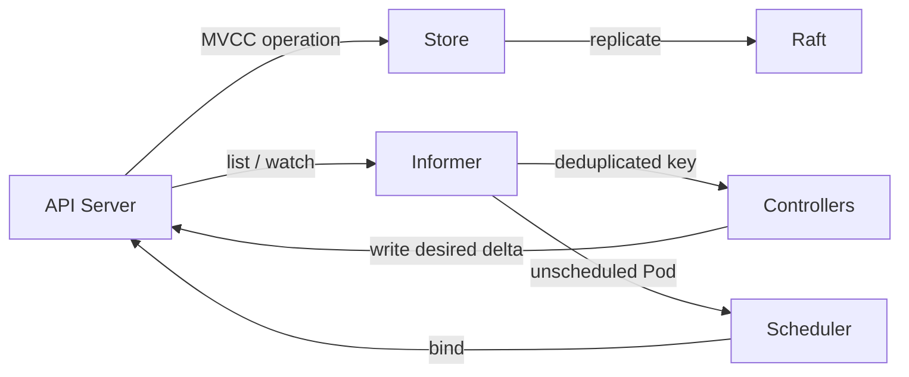

[仕様書の目次](../README.md)

# 制御面

> 対象読者: 分散システムの実装者、コントローラとスケジューラの実装者、形式検証の担当者

Ruby製の制御面を定義する。制御面は、APIが受理したdesired stateを永続化する。そのうえで、watchのイベントをもとにコントローラとスケジューラを動かし、actual stateをdesired stateに収束させる。

## コンポーネント間の流れ

## 文書

| 文書 | 内容 |
|---|---|
| [ストア](store.md) | MVCC、リビジョン、watchの履歴、トランザクション |
| [Raft](raft.md) | 選挙、WAL、コミット、スナップショット、メンバーシップ |
| [informer](informer.md) | Reflector、DeltaFIFO、Indexer、WorkQueue |
| [コントローラ](controllers.md) | reconcileの規約、組み込みのコントローラ、Controller DSL |
| [スケジューラ](scheduler.md) | Filter、Score、Bind、Preemption、プラグインDSL |

## Related

- [Control Loop図](../diagrams/03-control-loop.md)
- [Node](../node/README.md)
- [形式仕様](../verification/formal-methods.md)

