[仕様書の目次](../README.md) / [実装と納品](README.md)

# マイルストーンと完了の証拠

> 対象読者: 実装者、検証者、プロジェクトの管理者、リリース担当者、審査者
>
> 状態: 規範、版0.4

[実装順](implementation-plan.md)のstage 00〜15を、10個のマイルストーンにまとめる。マイルストーンは累積的で、機械的に判定できる。

マイルストーンは、機能を任意にするための境界ではない。すべてのMUST要件を壊さずに積み上げていくための、完了判定の境界である。

## 完了判定の共通規則

マイルストーンを`COMPLETE`とするのは、次の条件をすべて満たしたソース入力についてだけである。ソース入力は内容のダイジェストで識別する。

- そのマイルストーンと、それより前のすべてのマイルストーンの完了条件が、同じ入力のSHA-256で成立している。
- 必須テストについて、失敗、想定外のスキップ、未分類のテスト、再試行でしか成功しなかったテストが0である。
- ソース、生成物、テスト、形式仕様、構成図を含むファイルの一覧が、入力のダイジェストに含まれている。
- `artifacts/milestones/<milestone>/<run-id>/manifest.json`が、すべての証拠を参照している。
- 必要なプロファイルが複数ある場合は、すべてのプロファイルで成功している。一部のプロファイルの成功だけで完了としてはならない。

証拠には次の項目を含める。

- ホストのアーキテクチャ、kernel、Ruby
- 入力のダイジェストと、入力ファイルの数
- 取得している間、入力が変わらなかったこと
- 実行したコマンド
- 開始時刻と終了時刻
- 終了ステータス
- 結果の件数
- 成果物のSHA-256

完了済みのゲートが現在のソース入力で失敗した場合、その時点で、そのマイルストーン以降は再び未完了になる。

### Gitに依存しないこと

プロジェクトのソースツリーにGitリポジトリは作成しない。Gitのメタデータ、コミットのSHA、ブランチ、作業ツリーの状態を、ビルドや完了の証拠の前提にしてはならない。

複数のホストで取得した証拠が同じ入力に対するものかどうかは、入力のSHA-256と入力ファイルの数が一致するかどうかで判定する。入力のSHA-256は、パスとファイルのSHA-256から決定的に計算する。

### 完了条件にならないもの

作業量、期限、発表の予定、デモの成功は、完了条件にならない。

完了を判定するプログラムは、人間向けのログを入力にしない。上記のマニフェストと、機械可読なテスト結果を入力にする。条件を満たさない場合は、0以外の終了ステータスで失敗しなければならない。

## マイルストーンの依存関係

```mermaid
graph LR
    M0["M0 Executable Foundation"] --> M1["M1 Schema and API Core"]
    M1 --> M2["M2 Native Pod"]
    M2 --> M3["M3 Control Loops"]
    M3 --> M4["M4 Data Plane"]
    M4 --> M5["M5 Durable HA"]
    M5 --> M6["M6 Complete API Surface"]
    M6 --> M7["M7 MicroVM"]
    M7 --> M8["M8 Compatibility Closure"]
    M8 --> M9["M9 Release 1.0.0"]
```

| マイルストーン | 対応するstage | そこまでに達成すること |
|---|---:|---|
| M0 | 00 | Ruby package、process entry、Linux ABI境界が実機で成立する |
| M1 | 01〜02 | schemaからAPI surfaceを生成し、single-node APIが操作できる |
| M2 | 03〜04 | Native Runtimeで1 node Pod lifecycleが完結する |
| M3 | 05〜07 | Informer、Controller、Schedulerがdesired stateを収束させる |
| M4 | 08〜09 | Network、Service、DNS、Volumeを含むworkload data planeが成立する |
| M5 | 10、13 | 3/5 node Raftと全副作用のcrash recoveryが成立する |
| M6 | 11 | Kubernetes v1.36.2の全API、security、extension surfaceが埋まる |
| M7 | 12 | Firecracker MicroVM系RuntimeClassがL5を通過する |
| M8 | 14 | upstream testと実project corpusで互換性の欠落が0になる |
| M9 | 15 | 形式検証、性能、供給網、release evidenceを含む1.0.0 gateを通過する |

## M0 — Executable Foundation

### Deliverables

- Ruby 3.4以上でloadできる`rubernetes` packageとRBS baseline
- `rubectl`および5 daemonのprocess entry
- config load、dependency assembly、structured logging、signal shutdownを担うbootstrap layer
- `clone3`、pidfd、mount、netlink、BPF、KVMを型付きで公開するLinux platform adapter
- kernel header由来のABI manifestと再生成器

### Exit criteria

1. `gem build rubernetes.gemspec`と`rake test`が証跡対象のsource inputで成功する。
2. 6個のexecutableが`--version`と`--help`を副作用なしで終了status 0にする。
3. x86_64の実kernelで[stage 00](implementation-plan.md#sec-9-1)の全項目を通す。
4. ABI manifestと実行hostのsize、alignment、syscall numberの不一致が0である。
5. native extensionにpolicy branch、retry、authorization、state machineが0であることを静的検査する。
6. intentional failureごとに元の`errno`、operation、resource identityをRuby exceptionへ保持する。

### Required evidence

`gem-build.json`、`executables.json`、`abi-probe-x86_64.json`、JUnit、native-boundary scan結果、
全binaryとABI manifestのSHA-256を保存する。

## M1 — Schema and API Core

### Deliverables

- Kubernetes v1.36.2 corpus importer、Schema DSL、compiler、GVK/GVR registry
- Ruby type、validator、defaulting、codec、OpenAPI、RBS、Manifest DSL、diffの派生器
- API Server、MemoryStore、discovery、CRUD、watch、patch、server-side apply
- `rubectl`のkubeconfig、raw REST、manifest compile/apply経路

### Exit criteria

1. pinned corpusに存在する全built-in GVK/GVRがregistryに一度だけ登録される。
2. 全型でJSONとKubernetes Protobufのround-trip、unknown field、defaulting、validationがoracleと一致する。
3. 同一inputから2回生成したtreeのbyte差分が0で、source tree内のcanonical generated treeとの差分も0である。
4. Ruby accessor、RBS、OpenAPI、codec、patch field、DSL methodのfield集合差分が0である。
5. `kubectl v1.36.2 get/apply/patch/delete/watch`がMemoryStore clusterへ成功する。
6. successとerrorのHTTP status、headers、`Status` body、field ownershipがKubernetes oracleと一致する。
7. watchのreconnect、resourceVersion、bookmark、compaction境界をproperty testで満たす。

### Required evidence

`corpus-coverage.json`、`generation-diff.json`、全GVK round-trip report、API differential result、
kubectl transcriptを保存する。

## M2 — Native Pod

### Deliverables

- OCI pull、digest verification、layer展開、OverlayFS rootfs
- namespace、cgroup v2、capability、seccomp、Landlock、process lifecycleを担うNative Runtime
- Node Agentのregistration、SyncLoop、init/sidecar、probe、restart、termination、status更新
- rollback journal、orphan detection、startup reconciliation

### Exit criteria

1. x86_64 release targetでRuntime L0〜L3をすべて通す。ARM実機profileは完了条件に含めない。
2. image digest mismatch、path traversal、whiteout escape、symlink raceをfail-closedで拒否する。
3. init container、sidecar、startup/liveness/readiness probe、全restartPolicy、graceful terminationが
   Kubernetes oracleと同じ外部状態遷移を示す。
4. 1,000回のcreate/start/stop/deleteと各effect pointの失敗注入後に、mount、namespace、cgroup、
   process、pidfd、temporary fileのlive leakが0である。
5. agentを各effect point直後にSIGKILLして再起動しても、live workloadの誤削除とdead resourceの残留が0である。
6. 既存のPod manifestを無変更でapplyし、log、exec、attach、port-forwardを利用できる。

### Required evidence

x86_64 L0〜L3 report、kernel object inventory差分、Pod lifecycle trace、OCI攻撃corpus結果、
1,000-cycle resource ledgerを保存する。

## M3 — Control Loops

### Deliverables

- watch cache、Informer、index、WorkQueue、leader election
- Controller DSLと全built-in controller
- Scheduler DSLとv1.36.2標準plugin、preemption、binding

### Exit criteria

1. [Controller共通規約](../control-plane/controllers.md)の全規約を全controllerへ機械検査する。
2. v1.36.2 built-in controller corpusの未登録controllerが0である。
3. duplicate、out-of-order、watch reconnect、resync、controller restart下でもdesired stateへ収束する。
4. Deployment、StatefulSet、DaemonSet、Job、CronJobのrollout/rollback/scale/deleteがoracleと一致する。
5. schedulerのFilter結果、Score、tie break、preemption victim集合がoracle differentialで一致する。
6. controller-managerとschedulerのleader loss中に二重副作用が0で、quorum回復後60秒以内に収束を再開する。

### Required evidence

controller registry、reconcile idempotency matrix、scheduler differential result、leader-loss trace、
queue/informer property resultを保存する。

## M4 — Workload Data Plane

### Deliverables

- IPv4/IPv6 IPAM、bridge/veth/VXLAN、route、NetworkPolicy
- Service、EndpointSlice、DNS、eBPF/nftables proxy
- ephemeral/projected/local volume、PV/PVC/StorageClass、snapshot、CSI互換接続

### Exit criteria

1. x86_64のIPv4、IPv6、dual-stackでPod間通信、Service、DNS、Ingress/Egressを通す。
2. eBPFとnftablesの両backendで同じService semanticsを示し、backend切替時のconnection lossを測定する。
3. NetworkPolicyのdefault deny、selector、named port、`endPort`、SCTPをoracleと差分比較する。
4. projected ConfigMap/Secret更新がatomicで、途中世代をcontainerから観測できない。
5. PV/PVC binding、attach/mount/unmount/detach、snapshot/restoreを全access modeで検査する。
6. mount traversal、host path escape、attach race、node crash後の二重attachが0である。

### Required evidence

network matrix、packet trace、policy differential、proxy backend parity、volume lifecycle trace、
mount attack corpus結果を保存する。

## M5 — Durable High Availability

### Deliverables

- WAL、snapshot、log replication、membershipを備えたRaftStore
- 3/5 control-node構成、leader election、backup/restore
- 全effect pointのdurable ownership、operation journal、crash recovery

### Exit criteria

1. 3 nodeで1 failure、5 nodeで2 failure中もcommit済みstateを失わない。
2. acknowledged writeのRPOが0で、quorum回復後60秒以内にread/writeと制御loopを再開する。
3. disk full、short write、fsync error、torn WAL、snapshot corruptionをfail-closedで処理する。
4. partition、asymmetric partition、reorder、clock jumpを含むhistoryが線形化可能である。
5. membership changeとsnapshot install中のleader lossでsplit brainとlost commitが0である。
6. 全effect pointについてrequest lossとresponse lossを区別し、再実行で二重副作用を起こさない。

### Required evidence

linearizability histories、fault matrix、WAL/snapshot corruption corpus、RTO/RPO report、
resource ownership ledgerを保存する。Raft の TLC result は必須証拠から除外する
（理由は spec/verification/formal-methods.md 7.2 を参照）。

## M6 — Complete Kubernetes API Surface

### Deliverables

- 全built-in resource/subresource、CRD、conversion、aggregation、admission
- authentication、authorization、audit、encryption、API Priority and Fairness
- feature-gate別API、defaulting、validation、conversion behavior

### Exit criteria

1. v1.36.2 discovery、OpenAPI、protobuf descriptor、API operation corpusの未実装項目が0である。
2. 全feature gateの既定profileと有効profileでAPI差分が0である。
3. CRD structural schema、defaulting、pruning、conversion、subresource、OpenAPI publishがoracleと一致する。
4. webhook timeout、failure policy、reinvocation、match policy、version conversionを差分検査する。
5. authn/authz/admission/auditの順序とerror disclosureが仕様どおりである。
6. malformed、oversized、duplicate-key、content-negotiation fuzz corpusでpanic、hang、policy bypassが0である。

### Required evidence

API coverage ledger、feature-gate matrix、CRD/aggregation differential、security pipeline trace、
fuzz summaryとcrash corpusを保存する。

## M7 — MicroVM Isolation

### Deliverables

- Firecracker/jailer controller、guest image、Ruby guest supervisor、vsock protocol
- `microvm`と`microvm-restricted` RuntimeClass
- snapshot pool、identity rotation、dm-verity、host cleanup

### Exit criteria

1. Firecracker 1.16.1とpinned guest artifactでRuntime L0〜L5を通す。
2. jailer kill、VMM hang、UDS/vsock切断、pause ACK loss、snapshot corruptionをfail-closedで処理する。
3. snapshot cloneごとにCID、IP、UID、credential、policy generationを再発行し、identity reuseが0である。
4. malicious guestからjailer root、他VMのvsock、host filesystem、他tenant networkへ到達できない。
5. `microvm`で標準Pod lifecycle、probe、log、exec、volume、networkをNativeと同じAPI契約で利用できる。
6. cached base snapshotからのPod start p95が1.5秒以内である。

### Required evidence

x86_64 KVM L4/L5 report、guest/host attack matrix、identity ledger、snapshot corruption corpus、
startup latency raw samplesを保存する。

## M8 — Kubernetes Compatibility Closure

### Deliverables

- [Kubernetes互換性試験契約](../verification/kubernetes-compatibility.md)の全lane
- upstream test selection ledger、client version-skew matrix、real-project corpus
- CNCF提出形式と同じConformance evidence

### Exit criteria

1. v1.36.2 Conformance定義446件を、required profileごとにfailure 0、skip 0、flake 0で通す。
2. release profileごとに独立した3回のclean Conformance runを連続で得る。
3. portableなupstream Linux e2eのeligible testが100%成功し、未分類testが0である。
4. upstream Node Conformanceをx86_64でfailure 0、unexpected skip 0で通す。
5. Kubernetesのversion-skew policy内にある公開済みkubectl minorすべてでclient matrixを通す。
6. client-go、Dynamic Client、Helm、Kustomize、代表Operator/Chart corpusを変更なしで通す。
7. source patch、focus narrowing、skip追加、失敗結果の上書き、test timeout延長による黙殺が0である。
8. compatibility failure ledgerのopen itemが0である。

### Required evidence

HydrophoneとSonobuoyのraw log/JUnit、test inventory、selection ledger、architecture/network profile matrix、
client/project corpus結果、全run manifestを保存する。

## M9 — Release 1.0.0

### Deliverables

- reproducible source/gem/package/cluster artifactsとSBOM
- TLA+ model-check、Lean proof、trace refinement、security、performance、soak evidence
- install、upgrade、rollback、backup/restore、uninstall手順
- contest demonstrationと同一input SHA-256から再現できるevidence bundle

### Exit criteria

1. [release完了条件](implementation-plan.md#sec-9-3)を全項目満たす。
2. x86_64の独立したclean hostで同一sourceから再buildしたartifact digestが一致する。
3. TLA+ release scopeのcounterexampleが0、Leanの`sorry`、`admit`、禁止escape hatchが0である。
4. performance targetを同一hardwareのKubernetes v1.36.2 oracle比較で満たす。
5. 72時間soak中のunexpected process exit、resource leak、stuck queue、lost watch、lost commitが0である。
6. critical/high security finding、unreviewed dependency、unpinned production/test inputが0である。
7. project-authored production sourceのRuby比率が85%以上である。
8. clean hostにrelease artifactだけを導入し、cluster作成から全M8 gate実行まで再現できる。

### Required evidence

`release-manifest.json`、SBOM、signature、provenance、formal verification report、benchmark raw data、
72-hour soak report、security report、Ruby LOC report、clean-room reproduction transcriptを保存する。

## Related

- [実装順](implementation-plan.md)
- [Project Structure](project-structure.md)
- [Kubernetes互換性試験](../verification/kubernetes-compatibility.md)
- [検証戦略](../verification/testing.md)
