[仕様書の目次](../README.md) / [実装と納品](README.md)

# マイルストーンと完了の証拠

> 対象読者: 実装者、検証者、プロジェクトの管理者、リリース担当者、審査者
>
> 状態: 規範、版0.4

[実装順](implementation-plan.md)のstage 00〜15を、10個のマイルストーンにまとめる。マイルストーンは累積的で、機械的に判定できる。

マイルストーンは、機能を任意にするための境界ではない。すべてのMUST要件を壊さずに積み上げていくための、完了判定の境界である。

## 完了判定の共通規則

マイルストーンを`COMPLETE`とするのは、次の条件をすべて満たしたソース入力についてだけである。ソース入力は内容のダイジェストで識別する。

- そのマイルストーンと、それより前のすべてのマイルストーンの完了条件が、同じ入力のSHA-256で成立している。
- 必須テストについて、失敗、想定外のスキップ、未分類のテスト、再試行でしか成功しなかったテストが0である。
- ソース、生成物、テスト、形式仕様、構成図を含むファイルの一覧が、入力のダイジェストに含まれている。
- `artifacts/milestones/<milestone>/<run-id>/manifest.json`が、すべての証拠を参照している。
- 必要なプロファイルが複数ある場合は、すべてのプロファイルで成功している。一部のプロファイルの成功だけで完了としてはならない。

証拠には次の項目を含める。

- ホストのアーキテクチャ、kernel、Ruby
- 入力のダイジェストと、入力ファイルの数
- 取得している間、入力が変わらなかったこと
- 実行したコマンド
- 開始時刻と終了時刻
- 終了ステータス
- 結果の件数
- 成果物のSHA-256

完了済みのゲートが現在のソース入力で失敗した場合、その時点で、そのマイルストーン以降は再び未完了になる。

### Gitに依存しないこと

プロジェクトのソースツリーにGitリポジトリは作成しない。Gitのメタデータ、コミットのSHA、ブランチ、作業ツリーの状態を、ビルドや完了の証拠の前提にしてはならない。

複数のホストで取得した証拠が同じ入力に対するものかどうかは、入力のSHA-256と入力ファイルの数が一致するかどうかで判定する。入力のSHA-256は、パスとファイルのSHA-256から決定的に計算する。

### 完了条件にならないもの

作業量、期限、発表の予定、デモの成功は、完了条件にならない。

完了を判定するプログラムは、人間向けのログを入力にしない。上記のマニフェストと、機械可読なテスト結果を入力にする。条件を満たさない場合は、0以外の終了ステータスで失敗しなければならない。

## マイルストーンの依存関係

```mermaid
graph LR
    M0["M0 Executable Foundation"] --> M1["M1 Schema and API Core"]
    M1 --> M2["M2 Native Pod"]
    M2 --> M3["M3 Control Loops"]
    M3 --> M4["M4 Data Plane"]
    M4 --> M5["M5 Durable HA"]
    M5 --> M6["M6 Complete API Surface"]
    M6 --> M7["M7 MicroVM"]
    M7 --> M8["M8 Compatibility Closure"]
    M8 --> M9["M9 Release 1.0.0"]
```

| マイルストーン | 対応するstage | そこまでに達成すること |
|---|---:|---|
| M0 | 00 | Rubyのパッケージ、プロセスの入口、LinuxのABIとの境界が、実機で成立する |
| M1 | 01〜02 | スキーマからAPIを生成し、単一ノードのAPIを操作できる |
| M2 | 03〜04 | Nativeランタイムで、1ノードでのPodのライフサイクルが完結する |
| M3 | 05〜07 | informer、コントローラ、スケジューラが、desired stateに収束させる |
| M4 | 08〜09 | ネットワーク、Service、DNS、ボリュームを含むデータプレーンが成立する |
| M5 | 10、13 | 3ノードと5ノードのRaftと、すべての副作用についてのクラッシュからの回復が成立する |
| M6 | 11 | Kubernetes v1.36.2のすべてのAPI、セキュリティ、拡張の機能がそろう |
| M7 | 12 | FirecrackerによるMicroVM系のRuntimeClassがL5を通過する |
| M8 | 14 | upstreamのテストと実在のプロジェクトのコーパスで、互換性の欠落が0になる |
| M9 | 15 | 形式検証、性能、供給網、リリースの証拠を含む、1.0.0のゲートを通過する |

## M0 実行基盤

### 成果物

- Ruby 3.4以上で読み込める`rubernetes`パッケージと、RBSのベースライン
- `rubectl`と5つのデーモンの、プロセスの入口
- bootstrapの層。設定の読み込み、依存の組み立て、構造化ログ、シグナルによる停止を受け持つ
- Linuxプラットフォームのアダプタ。`clone3`、pidfd、mount、netlink、BPF、KVMを型付きで公開する
- kernelのヘッダから作ったABIマニフェストと、その再生成器

### 完了条件

1. 証拠の対象とするソース入力で、`gem build rubernetes.gemspec`と`rake test`が成功する。
2. 6つの実行ファイルが、`--version`と`--help`に対して、副作用を起こさずに終了ステータス0で終わる。
3. x86_64の実際のkernelで、[stage 00](implementation-plan.md#sec-9-1)のすべての項目を通過する。
4. ABIマニフェストと実行ホストの間で、サイズ、アラインメント、システムコール番号の不一致が0である。
5. ネイティブ拡張に、ポリシーの分岐、再試行、認可、状態機械が含まれていないことを、静的に検査する。
6. 意図的に起こした失敗のそれぞれについて、元の`errno`、操作、資源のidentityを、Rubyの例外に保持する。

### 必要な証拠

次のものを保存する。

- `gem-build.json`
- `executables.json`
- `abi-probe-x86_64.json`
- JUnit
- ネイティブ境界のスキャン結果
- すべてのバイナリとABIマニフェストのSHA-256

## M1 スキーマとAPIコア

### 成果物

- Kubernetes v1.36.2のコーパスのimporter、Schema DSL、コンパイラ、GVKとGVRのレジストリ
- 派生物の生成器。Rubyの型、validator、defaulting、コーデック、OpenAPI、RBS、Manifest DSL、diffを生成する
- APIサーバ、MemoryStore、discovery、CRUD、watch、patch、server-side apply
- `rubectl`の各経路。kubeconfig、生のREST、マニフェストのコンパイルとapply

### 完了条件

1. 固定したコーパスにあるすべての組み込みのGVKとGVRが、レジストリにちょうど1回ずつ登録されている。
2. すべての型で、JSONとKubernetes Protobufのround-trip、未知のフィールド、defaulting、validationが、比較対象と一致する。
3. 同じ入力から2回生成したツリーの間に、バイト単位の差分がない。ソースツリー内の正規の生成ツリーとの差分もない。
4. Rubyのアクセサ、RBS、OpenAPI、コーデック、patchのフィールド、DSLのメソッドの間で、フィールドの集合に差分がない。
5. `kubectl v1.36.2`の`get`、`apply`、`patch`、`delete`、`watch`が、MemoryStoreのクラスタに対して成功する。
6. 成功時とエラー時のHTTPステータス、ヘッダ、`Status`のボディ、フィールドの所有権が、Kubernetesと一致する。
7. watchの再接続、resourceVersion、bookmark、compactionの境界について、property testを満たす。

### 必要な証拠

次のものを保存する。

- `corpus-coverage.json`
- `generation-diff.json`
- 全GVKのround-tripのレポート
- APIの差分テストの結果
- kubectlの実行記録

## M2 Native Pod

### 成果物

- OCIイメージの取得、ダイジェストの検証、レイヤの展開、OverlayFSによるrootfs
- Nativeランタイム。namespace、cgroup v2、capability、seccomp、Landlock、プロセスのライフサイクルを受け持つ
- ノードエージェント。登録、SyncLoop、initコンテナとsidecar、probe、再起動、終了、statusの更新を行う
- ロールバック用のジャーナル、所有者のいない資源の検出、起動時の照合

### 完了条件

1. x86_64のリリース対象で、ランタイムのL0〜L3をすべて通過する。ARMの実機プロファイルは完了条件に含めない。
2. イメージのダイジェストの不一致、パストラバーサル、whiteoutによる脱出、symlinkのレースを、fail-closedで拒否する。
3. initコンテナ、sidecar、startup・liveness・readinessの各probe、すべてのrestartPolicy、graceful terminationが、Kubernetesと同じ外部状態の遷移を示す。
4. create、start、stop、deleteを1,000回繰り返したあと、資源のリークが0である。各effect pointで失敗を注入したあとも同様である。対象は、マウント、namespace、cgroup、プロセス、pidfd、一時ファイルである。
5. 各effect pointの直後にagentをSIGKILLして再起動しても、動いているワークロードを誤って削除しない。使われていない資源も残さない。
6. 既存のPodマニフェストを変更せずにapplyでき、log、exec、attach、port-forwardを使える。

### 必要な証拠

次のものを保存する。

- x86_64のL0〜L3のレポート
- kernelオブジェクトの一覧の差分
- Podのライフサイクルのトレース
- OCI攻撃コーパスの結果
- 1,000サイクル分の資源の台帳

## M3 制御ループ

### 成果物

- watchキャッシュ、informer、インデックス、WorkQueue、リーダー選出
- Controller DSLと、すべての組み込みコントローラ
- Scheduler DSLと、v1.36.2の標準プラグイン、preemption、binding

### 完了条件

1. [コントローラの共通規約](../control-plane/controllers.md)のすべての規約を、すべてのコントローラについて機械的に検査する。
2. v1.36.2の組み込みコントローラのコーパスに対して、未登録のコントローラが0である。
3. イベントの重複、順序の入れ替わり、watchの再接続、resync、コントローラの再起動が起きても、desired stateに収束する。
4. Deployment、StatefulSet、DaemonSet、Job、CronJobのrollout、rollback、scale、deleteが、比較対象と一致する。
5. スケジューラのFilterの結果、Score、同点時の選択、preemptionで退去させるPodの集合が、差分テストで比較対象と一致する。
6. controller-managerとschedulerのリーダーが失われている間、副作用が二重に起きない。quorumの回復から60秒以内に収束を再開する。

### 必要な証拠

次のものを保存する。

- コントローラのレジストリ
- reconcileの冪等性の表
- スケジューラの差分テストの結果
- リーダー喪失時のトレース
- キューとinformerのproperty testの結果

## M4 ワークロードデータプレーン

### 成果物

- IPv4とIPv6のIPAM、bridge・veth・VXLAN、経路、NetworkPolicy
- Service、EndpointSlice、DNS、eBPFとnftablesのプロキシ
- ephemeral・projected・localの各ボリューム、PV・PVC・StorageClass、スナップショット、CSI互換の接続

### 完了条件

1. x86_64のIPv4、IPv6、dual-stackで、Pod間の通信、Service、DNS、IngressとEgressが通る。
2. eBPFとnftablesの両方のbackendが、Serviceについて同じ意味論を示す。backendを切り替えたときの接続の切断を測定する。
3. NetworkPolicyのdefault deny、selector、名前付きポート、`endPort`、SCTPを、比較対象と差分比較する。
4. projectedなConfigMapとSecretの更新がatomicである。コンテナから途中の世代が見えない。
5. PVとPVCのbinding、attach、mount、unmount、detach、スナップショットとリストアを、すべてのaccess modeで検査する。
6. マウントのトラバーサル、hostPathからの脱出、attachのレース、ノードのクラッシュ後の二重attachが0である。

### 必要な証拠

次のものを保存する。

- ネットワークの組み合わせ表
- パケットのトレース
- ポリシーの差分テストの結果
- プロキシのbackend間の一致の結果
- ボリュームのライフサイクルのトレース
- マウント攻撃コーパスの結果

## M5 耐久性と高可用性

### 成果物

- RaftStore。WAL、スナップショット、ログの複製、メンバーシップを備える
- 制御ノード3台と5台の構成、リーダー選出、バックアップとリストア
- すべてのeffect pointについての、耐久性のある所有権、操作のジャーナル、クラッシュからの回復

### 完了条件

1. 3ノードで1台、5ノードで2台が故障している間も、コミット済みの状態を失わない。
2. ackを返した書き込みのRPOが0である。quorumの回復から60秒以内に、読み書きと制御ループを再開する。
3. ディスクフル、short write、fsyncのエラー、途中で切れたWAL、スナップショットの破損を、fail-closedで処理する。
4. 分断、非対称な分断、並べ替え、時刻のジャンプを含む履歴が、線形化可能である。
5. メンバーシップの変更中と、スナップショットのinstall中にリーダーが失われても、split brainとコミットの喪失が0である。
6. すべてのeffect pointについて、要求の喪失と応答の喪失を区別する。再実行しても副作用が二重に起きない。

### 必要な証拠

次のものを保存する。

- 線形化可能性の検査に使った履歴
- 障害の組み合わせ表
- WALとスナップショットの破損コーパス
- RTOとRPOのレポート
- 資源の所有権の台帳

RaftのTLCの結果は、必須の証拠から除外する。理由は[形式仕様の7.2](../verification/formal-methods.md#sec-7-2)に示す。

## M6 完全なKubernetes API

### 成果物

- すべての組み込みのresourceとsubresource、CRD、conversion、aggregation、admission
- 認証、認可、監査、暗号化、API Priority and Fairness
- feature gateごとのAPI、defaulting、validation、conversionの挙動

### 完了条件

1. v1.36.2のdiscovery、OpenAPI、protobufのディスクリプタ、API操作のコーパスに対して、未実装の項目が0である。
2. すべてのfeature gateについて、既定のプロファイルと有効にしたプロファイルで、APIの差分が0である。
3. CRDのstructural schema、defaulting、pruning、conversion、subresource、OpenAPIの公開が、比較対象と一致する。
4. webhookのタイムアウト、failure policy、reinvocation、match policy、バージョンの変換を、差分で検査する。
5. 認証、認可、admission、監査の順序と、エラーで開示する情報が、仕様どおりである。
6. 不正な入力、過大な入力、重複したキー、content negotiationのfuzzコーパスで、panic、ハング、ポリシーの回避が0である。

### Required evidence

API coverage ledger、feature-gate matrix、CRD/aggregation differential、security pipeline trace、
fuzz summaryとcrash corpusを保存する。

## M7 — MicroVM Isolation

### Deliverables

- Firecracker/jailer controller、guest image、Ruby guest supervisor、vsock protocol
- `microvm`と`microvm-restricted` RuntimeClass
- snapshot pool、identity rotation、dm-verity、host cleanup

### Exit criteria

1. Firecracker 1.16.1とpinned guest artifactでRuntime L0〜L5を通す。
2. jailer kill、VMM hang、UDS/vsock切断、pause ACK loss、snapshot corruptionをfail-closedで処理する。
3. snapshot cloneごとにCID、IP、UID、credential、policy generationを再発行し、identity reuseが0である。
4. malicious guestからjailer root、他VMのvsock、host filesystem、他tenant networkへ到達できない。
5. `microvm`で標準Pod lifecycle、probe、log、exec、volume、networkをNativeと同じAPI契約で利用できる。
6. cached base snapshotからのPod start p95が1.5秒以内である。

### Required evidence

x86_64 KVM L4/L5 report、guest/host attack matrix、identity ledger、snapshot corruption corpus、
startup latency raw samplesを保存する。

## M8 — Kubernetes Compatibility Closure

### Deliverables

- [Kubernetes互換性試験契約](../verification/kubernetes-compatibility.md)の全lane
- upstream test selection ledger、client version-skew matrix、real-project corpus
- CNCF提出形式と同じConformance evidence

### Exit criteria

1. v1.36.2 Conformance定義446件を、required profileごとにfailure 0、skip 0、flake 0で通す。
2. release profileごとに独立した3回のclean Conformance runを連続で得る。
3. portableなupstream Linux e2eのeligible testが100%成功し、未分類testが0である。
4. upstream Node Conformanceをx86_64でfailure 0、unexpected skip 0で通す。
5. Kubernetesのversion-skew policy内にある公開済みkubectl minorすべてでclient matrixを通す。
6. client-go、Dynamic Client、Helm、Kustomize、代表Operator/Chart corpusを変更なしで通す。
7. source patch、focus narrowing、skip追加、失敗結果の上書き、test timeout延長による黙殺が0である。
8. compatibility failure ledgerのopen itemが0である。

### Required evidence

HydrophoneとSonobuoyのraw log/JUnit、test inventory、selection ledger、architecture/network profile matrix、
client/project corpus結果、全run manifestを保存する。

## M9 — Release 1.0.0

### Deliverables

- reproducible source/gem/package/cluster artifactsとSBOM
- TLA+ model-check、Lean proof、trace refinement、security、performance、soak evidence
- install、upgrade、rollback、backup/restore、uninstall手順
- contest demonstrationと同一input SHA-256から再現できるevidence bundle

### Exit criteria

1. [release完了条件](implementation-plan.md#sec-9-3)を全項目満たす。
2. x86_64の独立したclean hostで同一sourceから再buildしたartifact digestが一致する。
3. TLA+ release scopeのcounterexampleが0、Leanの`sorry`、`admit`、禁止escape hatchが0である。
4. performance targetを同一hardwareのKubernetes v1.36.2 oracle比較で満たす。
5. 72時間soak中のunexpected process exit、resource leak、stuck queue、lost watch、lost commitが0である。
6. critical/high security finding、unreviewed dependency、unpinned production/test inputが0である。
7. project-authored production sourceのRuby比率が85%以上である。
8. clean hostにrelease artifactだけを導入し、cluster作成から全M8 gate実行まで再現できる。

### Required evidence

`release-manifest.json`、SBOM、signature、provenance、formal verification report、benchmark raw data、
72-hour soak report、security report、Ruby LOC report、clean-room reproduction transcriptを保存する。

## Related

- [実装順](implementation-plan.md)
- [Project Structure](project-structure.md)
- [Kubernetes互換性試験](../verification/kubernetes-compatibility.md)
- [検証戦略](../verification/testing.md)
