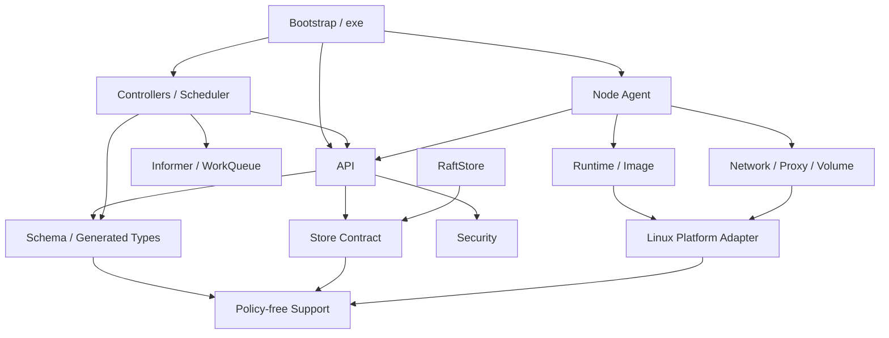

[仕様書の目次](../README.md) / [実装と納品](README.md)

<a id="project-structure"></a>
# プロジェクト構成

> 対象読者: 実装者、レビュア、ビルドの担当者、検証者
>
> 状態: 規範、版0.3

ソースツリーの配置と、依存の方向を定義する。Ruby中心の本番コード、生成物、LinuxのABI用のshim、upstreamとの互換性試験、形式仕様が混ざらないようにする。

ディレクトリがあることは、実装が完了していることを意味しない。完了しているかどうかは、[マイルストーン](milestones.md)の証拠だけで判定する。

## ソースツリー

```text
.
├── README.md
├── LICENSE
├── NOTICE                        # upstream由来の部分の出典とライセンス
├── Gemfile
├── Rakefile
├── rubernetes.gemspec
├── spec.md
├── spec/                         # 仕様と設計書の正本
│   ├── foundation/
│   ├── ruby/
│   ├── api/
│   ├── control-plane/
│   ├── node/
│   ├── verification/
│   ├── delivery/
│   └── diagrams/
├── exe/                          # 薄いプロセスの入口。ドメインのポリシーは置かない
│   ├── rubectl
│   ├── rubernetes-apiserver
│   ├── rubernetes-controller-manager
│   ├── rubernetes-scheduler
│   ├── rubernetes-agent
│   └── rubernetes-proxy
├── lib/
│   ├── rubernetes.rb             # 公開する名前空間の入口
│   └── rubernetes/
│       ├── version.rb
│       ├── bootstrap/             # 設定、依存のグラフ、プロセスのライフサイクル
│       ├── schema/                # スキーマDSL、コンパイラ、レジストリ、コーデック、defaulting
│       ├── api/                   # HTTP、認証と認可、admission、patchとapply、watch
│       ├── storage/               # Storeのインターフェースとオブジェクトの永続化
│       ├── consensus/             # Raft、WAL、スナップショット、メンバーシップ
│       ├── watch/                 # watchキャッシュ、informer、インデックス、WorkQueue
│       ├── controller/            # Controller DSLと組み込みのコントローラ
│       ├── scheduler/             # スケジューリングフレームワークとプラグイン
│       ├── node/                  # ノードの登録とPodのSyncLoop
│       ├── image/                 # OCIイメージの取得、検証、展開、キャッシュ
│       ├── runtime/
│       │   ├── native/             # namespace、cgroup、seccompによるプロセスのbackend
│       │   └── microvm/            # Firecracker、jailer、vsockによるbackend
│       ├── network/               # netlink、IPAM、VXLAN、ポリシー、DNS
│       ├── proxy/                 # eBPFとnftablesによるServiceのbackend
│       ├── volume/                # ボリューム、PVとPVC、スナップショット、CSIとの接続
│       ├── security/              # identity、ポリシー、監査、secretの基本部品
│       ├── observability/         # イベント、メトリクス、トレース、証拠の出力
│       ├── platform/linux/        # LinuxのABIを型付きで扱うRubyのアダプタ
│       └── support/               # ポリシーを持たない共通の基本部品
├── ext/rubernetes_linux/
│   ├── include/                   # 生成した、または手でレビューした最小限のCヘッダ
│   └── src/                       # ABI用のshimだけ。オーケストレーションのポリシーは置かない
├── schema/
│   ├── kubernetes/v1.36.2/       # 正規化して固定したKubernetesのスキーマ入力
│   └── rubernetes/                # プロジェクト独自の拡張スキーマの入力
├── generated/
│   ├── ruby/                      # 生成した型、コーデック、validator
│   ├── rbs/                       # 生成した公開シグネチャ
│   ├── openapi/                   # 生成した、提供用のスキーマ
│   └── fixtures/                  # 生成した、round-tripと差分テスト用のfixture
├── sig/                           # 生成対象の外にある、手書きのRBS
├── config/
│   ├── defaults/                  # バージョン付きの既定のプロセス設定
│   └── policies/                  # admission、監査、ランタイムのポリシーの入力
├── test/
│   ├── unit/
│   ├── property/
│   ├── integration/
│   ├── e2e/
│   ├── conformance/kubernetes/    # 改変していないupstreamのテストを実行するプロファイル
│   ├── compatibility/
│   │   ├── api/                    # 要求と応答の差分テストのコーパス
│   │   ├── clients/                # kubectl、client-go、Helm、Kustomizeの組み合わせ
│   │   └── projects/               # 改変していないChartとOperatorのコーパス
│   ├── chaos/                      # RubyのシナリオDSLと決定的な再生
│   ├── security/
│   ├── performance/
│   ├── support/
│   └── fixtures/
├── verification/
│   ├── tla/                       # TLA+のモジュールとTLCの設定
│   ├── lean/                      # 定義、証明、抽出した参照実装
│   └── traces/                    # トレースのスキーマ、対応付けの定義、回帰用のトレース
├── tools/                         # Rubyを中心にしたリポジトリの自動化
│   ├── schema/
│   ├── conformance/
│   ├── verification/
│   └── release/
├── third_party/
│   ├── locks/                     # ソース、成果物、イメージの変更できないダイジェスト
│   └── cache/                     # ダウンロードしたupstreamの成果物
├── apps/
│   └── dashboard/                 # Rails製のダッシュボード兼メトリクスサーバ
├── examples/
│   ├── manifests/
│   ├── controllers/
│   └── scenarios/
├── benchmarks/
│   ├── api/
│   ├── runtime/
│   └── scheduler/
├── deploy/
│   ├── cluster/                   # 自己ホストとbootstrapのためのデプロイ入力
│   └── systemd/                   # ホストのサービスユニットと、堅牢化のための上書き設定
├── packaging/                     # 再現可能なパッケージの定義
├── artifacts/                     # ローカルとCIの証拠の出力先。管理対象外
├── build/                         # ビルドの出力先。管理対象外
└── tmp/                           # 実行時の作業領域。管理対象外
```

`exe/`の6ファイルは、M0で生成または実装する必須の入口である。ひな形の段階では、`exe/README.md`がその境界を保持する。実装されていないバイナリを、成功を返すスタブとして置いてはならない。

## ソース管理の方針

プロジェクトのソースツリーにGitリポジトリは作成しない。ビルド、テスト、証拠、リリースの自動化は、次のものに依存してはならない。

- Gitのコマンド
- コミットのSHA
- ブランチ
- タグ
- 作業ツリーの状態

ソースを識別するときと、複数のホストの証拠が同じ入力のものかを判定するときは、決定的な入力ダイジェストを使う。入力ダイジェストは、対象のファイルの相対パスとSHA-256から生成する。

## モジュールの依存方向



矢印は、元のモジュールが先のモジュールに依存してよいことを表す。次のものは禁止する。

- 矢印と逆向きのimport
- プロセス単位のシングルトンを経由した、隠れた逆向きの依存
- 定数の探索を使った循環の回避

## 層ごとの規則

### 公開する入口とbootstrap

- `lib/rubernetes.rb`は、安定した公開の名前空間だけを読み込む。デーモンは起動しない。
- `exe/*`が行うのは、引数の解釈、設定ファイルのパスの確定、終了コードへの変換だけである。
- 具体的な実装を組み立てるのは`bootstrap/`だけである。ドメインのモジュールは`bootstrap/`に依存しない。
- プロセス間の通信は、[アーキテクチャ](../foundation/architecture.md)で定義したプロトコルの境界を通す。

### スキーマと生成コード

- `schema/`はコンパイラへの入力である。`lib/rubernetes/schema/`はコンパイラの実装である。`generated/`は出力である。
- 生成したRubyは`Rubernetes::Generated`の下に置く。手書きのクラスと同じ定数を再オープンしない。
- 生成したファイルは、生成器のバージョン、入力のダイジェスト、出力スキーマのバージョンをヘッダに持つ。
- CIは生成を2回実行し、結果がバイト単位で同一であることを検査する。正規の生成ツリーとの差分がないことも検査する。

### Store and consensus

- `storage/`が`Store` interface、transaction、revision、watch eventの意味を所有する。
- `consensus/`は`Store`のdurable implementationを提供し、API object semanticsを所有しない。
- controller、scheduler、nodeはWALやRaft nodeへ直接アクセスせず、APIまたは明示したStore contractを使う。

### Node and Linux boundary

- `node/`はPod desired/observed stateとrollback順序を所有する。
- `runtime/`、`network/`、`proxy/`、`volume/`は互いのprivate implementationへ依存せず、Node Agentのcontractで接続する。
- `platform/linux/`はsyscall、netlink、BPF、KVM ABIをRuby objectとして公開するがpolicyを決めない。
- `ext/rubernetes_linux/`はFFIで安全に表現できないABI shimだけを含み、production sourceのRuby比率計算に含める。

### Verification and upstream code

- `test/conformance/kubernetes/`はpinned upstream binary/imageを実行するadapterだけを保持する。
- Kubernetes、etcd、runc/containerd、CNI/CSI oracle codeは`lib/`、`exe/`、production packageへ入れてはならない。
- upstream sourceとbinaryは`third_party/cache/`へ取得し、`third_party/locks/`のdigestと一致しなければ実行しない。
- TLA+/Lean sourceは`verification/`、Rubyとのrefinement/trace adapterは`lib/rubernetes/observability/`と
  `tools/verification/`に分ける。
- raw resultは`artifacts/`へ出力し、回帰入力へ採用した最小反例だけを`test/fixtures/`または
  `verification/traces/`へsource artifactとして保存する。

## Namespace Mapping

| Filesystem | Ruby namespace |
|---|---|
| `lib/rubernetes/api/` | `Rubernetes::API` |
| `lib/rubernetes/storage/` | `Rubernetes::Storage` |
| `lib/rubernetes/consensus/` | `Rubernetes::Consensus` |
| `lib/rubernetes/controller/` | `Rubernetes::Controller` |
| `lib/rubernetes/scheduler/` | `Rubernetes::Scheduler` |
| `lib/rubernetes/node/` | `Rubernetes::Node` |
| `lib/rubernetes/runtime/native/` | `Rubernetes::Runtime::Native` |
| `lib/rubernetes/runtime/microvm/` | `Rubernetes::Runtime::MicroVM` |
| `lib/rubernetes/platform/linux/` | `Rubernetes::Platform::Linux` |
| `generated/ruby/` | `Rubernetes::Generated` |

file path、module namespace、主要public class名は一致させる。acronymはRuby constantでは
`API`、`OCI`、`IPAM`、`UID`、`GVK`、`GVR`を用い、filenameでは`api`、`oci`、`ipam`、
`uid`、`gvk`、`gvr`を用いる。

## Test Placement Rule

testは対象classのdirectoryではなく、保証levelで配置する。同一behaviorにunit、property、integration、
E2Eがある場合は同じscenario IDをmetadataへ付ける。production bugから得た最小反例は、最も低いlevelで
再現するtestと、必要ならend-to-end regressionの両方へ固定する。

upstream testをcopyして改変したものはConformance evidenceに数えない。補助testとして保持する場合は
`test/compatibility/`へ置き、upstream file、commit、変更理由をmetadataへ記録する。

## Build and Artifact Policy

- source treeへのbuild output書込み先は`build/`だけとする。
- runtime scratchは`tmp/`、test/release evidenceは`artifacts/`へ分離する。
- `generated/`はsource artifactとして保持し、`build/`、`tmp/`、`artifacts/`はsource inputと配布物から除外する。
- release packageは`lib/`、`generated/ruby/`、必要な`config/`、native extensionだけを含める。
- `test/`、`verification/`、`third_party/cache/`、oracle binaryをproduction packageへ含めてはならない。

## Adding a Directory

新しいtop-level directoryは、既存boundaryで表現できず、次を同じ変更で満たす場合だけ追加する。

1. 本文にsingle responsibilityとownerを追加する。
2. dependency diagramへ依存方向を追加し、cycleが0であることを検査する。
3. build/package includeまたはexclude規則を更新する。
4. test placementとrelease artifactへの影響を定義する。
5. `spec/README.md`または該当family indexから到達可能にする。

## Related

- [マイルストーン](milestones.md)
- [Coding Standards](coding-standards.md)
- [Architecture](../foundation/architecture.md)
- [Kubernetes互換性試験](../verification/kubernetes-compatibility.md)
