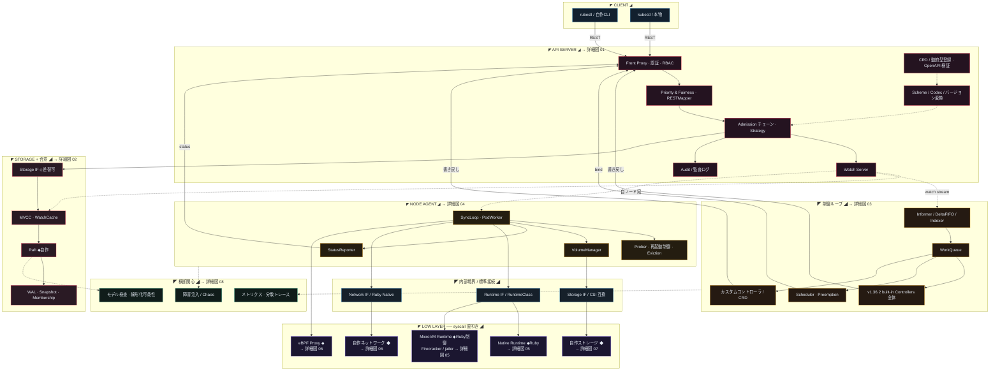

[仕様書の目次](../README.md) / [構成図](README.md)

# A.0 図00 全景

> 対象読者: 全読者、アーキテクト
>
> 状態: 規範、版0.2

クライアントから低層のランタイム、検証の層までを含む、システム全体のコンポーネントの配置を示す。

## 関連

- [architecture](../foundation/architecture.md)
- [構成図インデックス](README.md)
