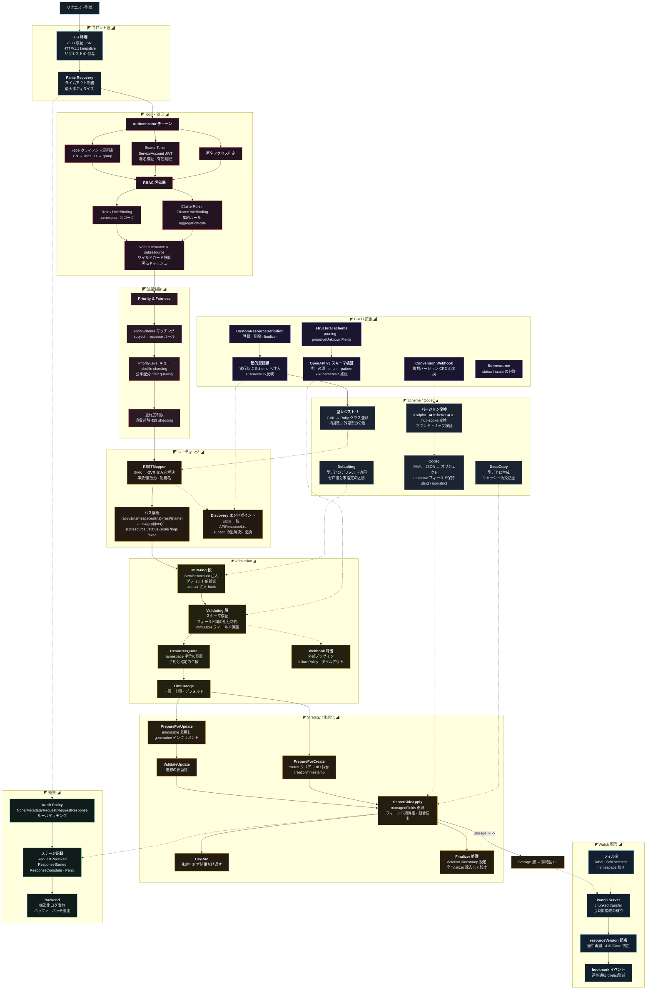

[仕様書の目次](../README.md) / [構成図](README.md)

# A.1 図01 APIサーバ

> 対象読者: APIサーバの実装者
>
> 状態: 規範、版0.2

APIリクエストの処理経路と、admission、スキーム、ストレージとの接続を示す。

## 関連

- [api server](../api/api-server.md)
- [kubernetes api](../api/kubernetes-api.md)
- [構成図インデックス](README.md)
