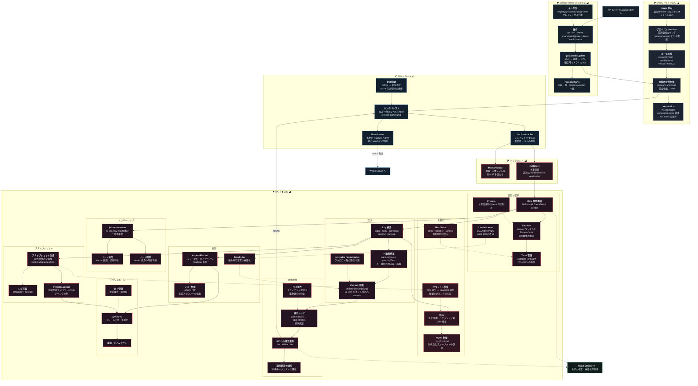

[仕様書の目次](../README.md) / [構成図](README.md)

# A.2 図 02 — Storage / Raft

> **Audience:** Store/Raft実装者、形式検証者
>
> **Status:** Normative — version 0.2

MVCC、watch、WAL、Raft、snapshot、failure pathを示す。

## Related

- [store](../control-plane/store.md)
- [raft](../control-plane/raft.md)
- [構成図インデックス](README.md)
