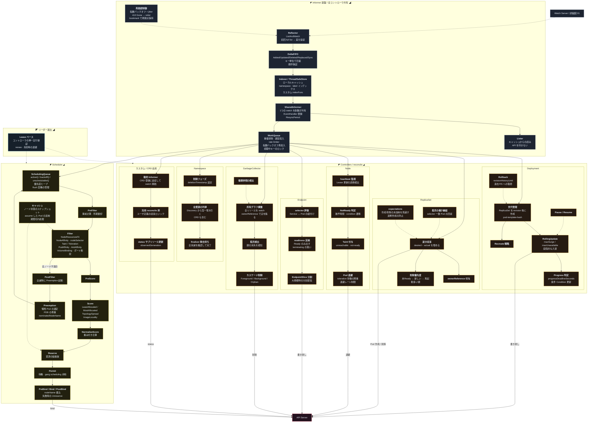

[仕様書の目次](../README.md) / [構成図](README.md)

# A.3 図 03 — 制御ループ

> **Audience:** Controller/Scheduler実装者
>
> **Status:** Normative — version 0.2

Informer、WorkQueue、built-in/custom controller、schedulerのevent flowを示す。

## Related

- [informer](../control-plane/informer.md)
- [controllers](../control-plane/controllers.md)
- [scheduler](../control-plane/scheduler.md)
