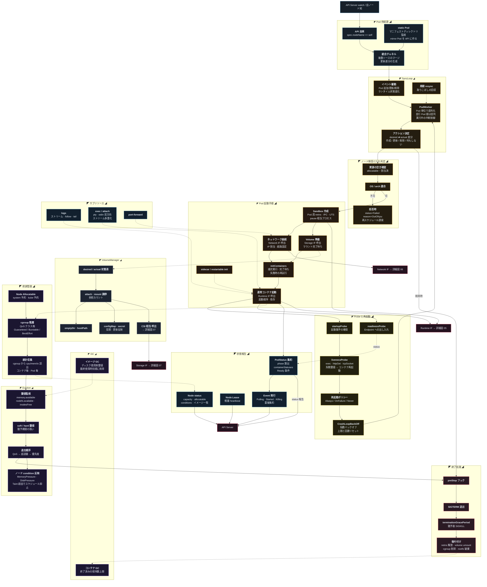

[仕様書の目次](../README.md) / [構成図](README.md)

# A.4 図04 ノードエージェント

> 対象読者: ノードエージェントとランタイムの実装者
>
> **Status:** Normative — version 0.2

Pod workerからruntime、network、volume、statusへのlifecycle flowを示す。

## Related

- [node agent](../node/node-agent.md)
- [runtime](../node/runtime.md)
- [構成図インデックス](README.md)
