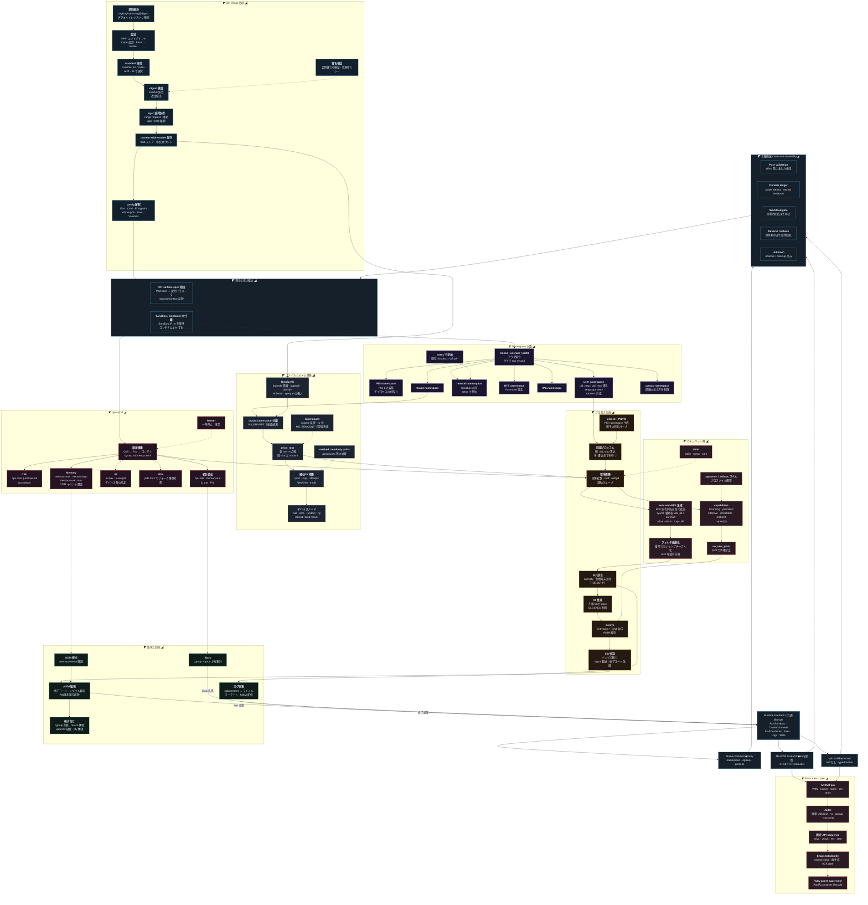

[仕様書インデックス](../README.md) / [diagrams](README.md)

# A.5 図 05 — Runtime

> **Audience:** Runtime実装者、セキュリティ検証者
>
> **Status:** Normative — version 0.2

Native/MicroVM、ownership、image、namespace、filesystem、cgroup、security、recoveryを示す。

## Related

- [runtime](../node/runtime.md)
- [formal methods](../verification/formal-methods.md)
- [構成図インデックス](README.md)
