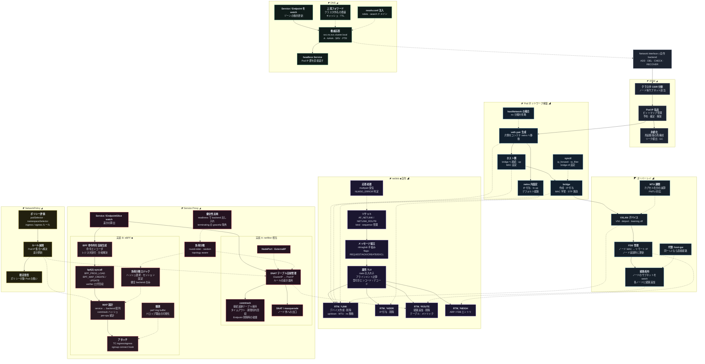

[仕様書の目次](../README.md) / [構成図](README.md)

# A.6 図06 ネットワーク

> 対象読者: ネットワークとServiceの実装者
>
> 状態: 規範、版0.2

netlink、IPAM、Podネットワーク、オーバーレイ、NetworkPolicy、DNS、サービスプロキシを示す。

## Related

- [network](../node/network.md)
- [service proxy](../node/service-proxy.md)
- [構成図インデックス](README.md)
