[仕様書の目次](../README.md) / [構成図](README.md)

# A.7 図07 ストレージとボリューム

> 対象読者: ボリュームとストレージの実装者
>
> 状態: 規範、版0.2

PV/PVC、controller、CSI、built-in volume、mount ownershipを示す。

```mermaid
graph TB

VM["VolumeManager / 詳細図 04"]

subgraph API["◤ API 型 ◢"]
    A1["<b>PersistentVolume</b><br/>capacity · accessModes<br/>reclaimPolicy · nodeAffinity"]
    A2["<b>PersistentVolumeClaim</b><br/>要求容量 · StorageClass<br/>bound 状態"]
    A3["<b>StorageClass</b><br/>provisioner · parameters<br/>volumeBindingMode<br/>allowVolumeExpansion"]
    A4["<b>VolumeAttachment</b><br/>ノードへの attach 状態"]
    A5["<b>VolumeSnapshot</b><br/>スナップショットと復元"]
end

subgraph CTL["◤ コントローラ群 ◢"]
    C1["<b>PV Binder</b><br/>PVC ↔ PV マッチング<br/>容量 · accessMode · selector<br/>bound の双方向記録"]
    C2["<b>動的プロビジョニング</b><br/>該当 PV 不在時に生成要求<br/>StorageClass の parameters 適用"]
    C3["<b>WaitForFirstConsumer</b><br/>スケジュール確定まで遅延<br/>トポロジ考慮の binding"]
    C4["<b>AttachDetach</b><br/>ノード単位の attach 調停<br/>多重 attach の抑止"]
    C5["<b>Reclaim</b><br/>Delete / Retain<br/>解放時の後処理"]
    C6["<b>Expansion</b><br/>容量拡張の要求伝播<br/>オンライン拡張"]
    C7["<b>Snapshot コントローラ</b><br/>取得 · 復元 · GC"]
end

subgraph IFACE["◤ Storage Interface ◇差替可 / CSI 相当 ◢"]
    I1["<b>Identity</b><br/>プラグイン情報 · 能力申告"]
    I2["<b>Controller Service</b><br/>CreateVolume · DeleteVolume<br/>ControllerPublish / Unpublish<br/>CreateSnapshot · Expand"]
    I3["<b>Node Service</b><br/>NodeStageVolume<br/>NodePublishVolume<br/>NodeUnpublish / Unstage<br/>NodeGetVolumeStats"]
    I4["<b>能力ネゴシエーション</b><br/>STAGE_UNSTAGE の有無<br/>ブロック / ファイルの別"]
end

subgraph PLUG["◤ 実装 ◢"]

    subgraph INTREE["組込み実装 ◆自作"]
        P1["<b>emptyDir</b><br/>tmpfs or ディスク<br/>Pod 消滅で破棄<br/>sizeLimit 制御"]
        P2["<b>hostPath</b><br/>型検査 DirectoryOrCreate 等<br/>セキュリティ制限"]
        P3["<b>configMap / secret</b><br/>atomic writer<br/>シンボリックリンク切替で無停止更新<br/>更新の反映ループ<br/>secret は tmpfs 常駐"]
        P4["<b>downwardAPI</b><br/>Pod メタデータの投影"]
        P5["<b>projected</b><br/>複数ソースの合成<br/>ServiceAccount token の期限更新"]
        P6["<b>local PV</b><br/>ノード固定 · nodeAffinity"]
    end

    subgraph LOOPDEV["ブロック層 ◆自作"]
        Q1["<b>loop デバイス</b><br/>loop-control ioctl<br/>ファイル → ブロック化"]
        Q2["<b>mkfs 実行</b><br/>初回フォーマット判定<br/>blkid 相当の型判定"]
        Q3["<b>mount(2) 直叩き</b><br/>fstype · flags · data<br/>MS_BIND · MS_RDONLY · MS_REMOUNT"]
        Q4["<b>umount2</b><br/>MNT_DETACH フォールバック<br/>busy 時の再試行"]
        Q5["<b>device-mapper</b><br/>シンプロビジョニング<br/>スナップショット target"]
        Q6["<b>quota / sizeLimit</b><br/>project quota で上限"]
    end

    subgraph EXT["外部委譲"]
        R1["既存 CSI ドライバ<br/>gRPC で委譲"]
    end
end

subgraph MOUNT["◤ マウント調停 ◢"]
    M1["<b>desired / actual 状態表</b><br/>ノード上の全 volume"]
    M2["<b>参照カウント</b><br/>複数 Pod 共有時の解放判断"]
    M3["<b>global mount</b><br/>stage 先 → publish で bind"]
    M4["<b>SELinux / 所有者調整</b><br/>fsGroup 再帰 chown<br/>大規模時の遅延対策"]
    M5["<b>subPath</b><br/>安全な解決 · シンボリックリンク攻撃対策"]
    M6["<b>mountPropagation</b><br/>None / HostToContainer / Bidirectional"]
end

subgraph OBS["◤ 監視 ◢"]
    O1["<b>使用量取得</b><br/>statfs で容量 · inode"]
    O2["<b>逼迫検出</b><br/>Eviction へ通知"]
    O3["<b>孤児 volume GC</b><br/>Pod 消滅後の残留回収"]
end

A2 --> C1
A1 --> C1
A3 --> C2 --> I2
C1 --> C3
C3 -.->|"スケジュール結果待ち"| C1
C1 --> C4 --> I2
C5 -.-> I2
A3 --> C6 --> I2
A5 --> C7 --> I2
A4 -.-> C4

VM --> I3
I1 -.-> I4 -.-> I3
I2 --> P1
I3 --> P1
I3 --> P2
I3 --> P3
I3 --> P4
I3 --> P5
I3 --> P6
I2 --> R1
I3 --> R1
I3 --> Q1

Q1 --> Q2 --> Q3
Q5 -.-> Q1
Q6 -.-> Q3
Q3 --> M3
Q4 -.-> M2

M1 --> M2 --> M3 --> M4
M5 -.-> M3
M6 -.-> M3
M3 -->|"コンテナへ bind mount"| RT["Runtime / 詳細図 05"]
P3 -.-> M3
P1 -.-> M3

M3 --> O1 --> O2
O3 -.-> M1

classDef ap fill:#241320,stroke:#e0294b,color:#e6ecf5
classDef ct fill:#251a12,stroke:#e0a029,color:#e6ecf5
classDef if fill:#16202a,stroke:#4b9fd6,color:#e6ecf5
classDef pl fill:#12202e,stroke:#4b9fd6,color:#e6ecf5
classDef lo fill:#1b1630,stroke:#8b6ef0,color:#e6ecf5
classDef mo fill:#1d2431,stroke:#7f8da5,color:#e6ecf5
classDef ob fill:#101c1a,stroke:#3fae8f,color:#e6ecf5

class A1,A2,A3,A4,A5 ap
class C1,C2,C3,C4,C5,C6,C7 ct
class I1,I2,I3,I4,VM,RT if
class P1,P2,P3,P4,P5,P6,R1 pl
class Q1,Q2,Q3,Q4,Q5,Q6 lo
class M1,M2,M3,M4,M5,M6 mo
class O1,O2,O3 ob
```

## Related

- [volume](../node/volume.md)
- [runtime](../node/runtime.md)
- [構成図インデックス](README.md)
