[仕様書の目次](../README.md) / [構成図](README.md)

# A.8 図08 検証

> 対象読者: 形式検証の担当者、テストの実装者、審査者
>
> **Status:** Normative — version 0.2

TLA+、Lean、Ruby実装、fault injection、保証判定のbridgeを示す。

```mermaid
graph TB

%% ═══════════ 08 · VERIFICATION ═══════════
%% 役割分担:
%%   TLA+ … 時間・並行・分散。時相性質と活性
%%   Lean … 純粋ロジック。全域性・停止性・定理
%%   実行時 … 実装が仕様に従っているかの経験的確認

subgraph SPLIT["◤ 何をどこで検証するか ◢"]
    SP_T["<b>TLA+ の担当</b><br/>複数プロセスの相互作用<br/>非同期 · メッセージ順序<br/>時相性質 / □ ◇<br/>活性 · 公平性 · 収束"]
    SP_L["<b>Lean の担当</b><br/>単一関数の入出力<br/>全域性 · 停止性 · 決定性<br/>データ構造の代数的性質<br/>全 domain に対する定理"]
    SP_R["<b>実行時の担当</b><br/>実装と仕様のズレ検出<br/>実機でしか出ない挙動<br/>性能 · 資源"]
end

%% ─────────── TLA+ ───────────
subgraph TLA["◤ TLA+ / TLC ◢"]
    subgraph TL_R["Raft"]
        TR_SPEC["<b>仕様</b><br/>Server 状態 · currentTerm<br/>log · commitIndex<br/>メッセージ集合"]
        TR_INV["<b>不変条件</b><br/>ElectionSafety<br/>LeaderAppendOnly<br/>LogMatching<br/>LeaderCompleteness<br/>StateMachineSafety"]
        TR_LIVE["<b>活性</b><br/>◇ リーダーが選出される<br/>分断回復 ⟹ ◇ 収束<br/>弱公平性の仮定"]
    end
    subgraph TL_C["制御ループ"]
        TC_SPEC["<b>仕様</b><br/>desired / actual<br/>コントローラ並行動作<br/>watch イベントの遅延・欠落"]
        TC_INV["<b>不変条件</b><br/>Pod 数が上限を超えない<br/>二重スケジュールしない<br/>孤児が残らない"]
        TC_LIVE["<b>活性</b><br/>◇ actual = desired<br/>ロールアウトが完了する<br/>スタベーションしない"]
    end
    subgraph TL_RT["Runtime lifecycle"]
        TT_SPEC["<b>仕様</b><br/>状態 · owned resource<br/>effect · crash · response loss"]
        TT_INV["<b>不変条件</b><br/>live owner の資源を解放しない<br/>Unknown から実行しない<br/>identity を再利用しない"]
        TT_LIVE["<b>活性</b><br/>cleanup 障害回復後<br/>◇ Stopped / Removed"]
    end
    subgraph TL_M["モデル検査"]
        TM_TLC["<b>TLC 実行</b><br/>状態空間 BFS<br/>対称性簡約 / VIEW<br/>制約でスコープ限定"]
        TM_SIM["<b>決定的シミュレーション</b><br/>障害注入で不変条件を検査<br/>Raft は網羅探索が完了しないため<br/>TLC の必須対象外（7.2）"]
        TM_CEX["<b>反例</b><br/>最短遷移列<br/>Ruby の再現テストへ変換"]
    end
end

TR_SPEC --> TR_INV --> TM_SIM
TR_SPEC --> TR_LIVE --> TM_SIM
TC_SPEC --> TC_INV --> TM_TLC
TC_SPEC --> TC_LIVE --> TM_TLC
TT_SPEC --> TT_INV --> TM_TLC
TT_SPEC --> TT_LIVE --> TM_TLC
TM_TLC --> TM_CEX

%% ─────────── Lean ───────────
subgraph LEAN["◤ Lean 4 ◢"]
    subgraph LN_CORE["対象ロジックの形式化"]
        LL_LOG["<b>Raft ログ演算</b><br/>append · truncate · 一致判定<br/>LogMatching を帰納法で証明<br/>有界なシミュレーション検査を全 domain へ拡張"]
        LL_SEC["<b>seccomp フィルタ生成</b><br/>ポリシー DSL の意味論定義<br/>生成 BPF ⟦compile p⟧ = ⟦p⟧<br/>コンパイラ正当性"]
        LL_IPAM["<b>IPAM</b><br/>払出 IP の非重複性<br/>回収後の再利用可能性<br/>サブネット分割の網羅性"]
        LL_SCHED["<b>Scheduler</b><br/>Filter の全域性<br/>Score の決定性 · 単調性<br/>同点処理の well-defined 性"]
        LL_OVL["<b>OverlayFS 合成</b><br/>レイヤ合成の結合律<br/>whiteout の意味論<br/>上書き順序の正当性"]
        LL_CG["<b>cgroup 階層</b><br/>制限の伝播が単調<br/>子は親を超えない"]
        LL_SCHEMA["<b>schema compiler</b><br/>Ruby · RBS · codec · OpenAPI<br/>field集合の完全一致"]
        LL_ROLL["<b>rollback planner</b><br/>依存DAGの逆順だけを生成<br/>live owner を先に停止"]
        LL_IDENT["<b>snapshot identity</b><br/>旧集合と復元集合がdisjoint<br/>nonce · token · CID · IP"]
    end
    subgraph LN_OUT["成果物"]
        LO_THM["<b>定理</b><br/>証明済み性質の一覧"]
        LO_REF["<b>参照実装</b><br/>Lean から抽出<br/>実行可能な仕様"]
        LO_PROP["<b>述語</b><br/>証明した性質を<br/>プロパティテストへ書下し"]
    end
end

LL_LOG --> LO_THM
LL_SEC --> LO_REF
LL_IPAM --> LO_REF
LL_SCHED --> LO_PROP
LL_OVL --> LO_THM
LL_CG --> LO_PROP
LL_SCHEMA --> LO_THM
LL_ROLL --> LO_REF
LL_IDENT --> LO_THM

%% ─────────── 橋渡し ───────────
subgraph BRIDGE["◤ 形式仕様 ⇄ Ruby 実装 の橋渡し ◢"]
    BR_DIFF["<b>差分テスト</b><br/>Lean 抽出の参照実装と<br/>Ruby 実装を同一入力で比較<br/>不一致を最小反例に shrink"]
    BR_PROP["<b>プロパティテスト</b><br/>証明済み述語を実装に適用<br/>操作列をランダム生成"]
    BR_TRACE["<b>トレース照合</b><br/>実装の実行履歴を<br/>TLA+ 仕様の遷移列として検査<br/>仕様外遷移の検出"]
    BR_REG["<b>回帰固定</b><br/>反例を恒久テスト化<br/>CI で常時実行"]
end

LO_REF --> BR_DIFF
LO_PROP --> BR_PROP
TM_CEX --> BR_REG
TR_SPEC -.->|"許容遷移"| BR_TRACE

%% ─────────── 実行時検証 ───────────
subgraph RT["◤ 実行時検証 ◢"]
    subgraph RT_LIN["線形化可能性"]
        RL_HIST["<b>履歴収集</b><br/>invoke / ok / fail / info<br/>単調時計で順序付け"]
        RL_MODEL["<b>逐次モデル</b><br/>Lean 抽出の KV 参照実装"]
        RL_SRCH["<b>探索</b><br/>Wing&amp;Gong<br/>枝刈り · メモ化"]
        RL_VERD["<b>判定</b><br/>線形化順序を提示<br/>違反時は矛盾操作対"]
    end
    subgraph RT_CH["障害注入 / nemesis"]
        RC_SCHED["<b>シナリオ制御</b><br/>注入周期 · 回復<br/>DSL でシナリオ記述"]
        RC_PROC["プロセス<br/>SIGKILL / SIGSTOP / 再起動"]
        RC_NET["ネットワーク<br/>分断 · 非対称分断 · ring<br/>遅延 · ロス · 並替"]
        RC_DISK["ディスク<br/>fsync 失敗 · WAL 切断<br/>領域枯渇"]
        RC_CLK["時計<br/>ずらし · 巻戻し"]
        RC_RES["資源<br/>メモリ逼迫 · CPU 飽和"]
        RC_RT["Runtime<br/>全 effect point 失敗<br/>応答消失 · cleanup 失敗"]
        RC_VM["MicroVM<br/>pause ACK 消失 · VMM hang<br/>snapshot破損 · vsock切断"]
    end
    subgraph RT_ISO["隔離の実証"]
        RI_NS["他 Pod の namespace が見えない"]
        RI_CG["cgroup 上限を超えない"]
        RI_SEC["禁止 syscall が実機で弾かれる<br/>Lean の証明を実機で裏取り"]
        RI_VM["jailer · dm-verity · vsock<br/>実KVM上で境界を検査"]
        RI_ID["snapshot clone間で<br/>identity/secret/IP再利用なし"]
    end
end

RL_MODEL --> RL_SRCH
RL_HIST --> RL_SRCH --> RL_VERD
RC_SCHED --> RC_PROC
RC_SCHED --> RC_NET
RC_SCHED --> RC_DISK
RC_SCHED --> RC_CLK
RC_SCHED --> RC_RES
RC_SCHED --> RC_RT
RC_SCHED --> RC_VM
LO_REF -.->|"参照実装として"| RL_MODEL
LL_SEC -.->|"証明した許可集合"| RI_SEC

%% ─────────── 対象 ───────────
subgraph TGT["◤ 検証対象 / 実装本体 ◢"]
    TG_RAFT["Raft 実装"]
    TG_KV["状態機械 / KV"]
    TG_CTL["reconcile ループ"]
    TG_RT["ランタイム"]
    TG_SCHEMA["schema compiler / 生成物"]
end

RC_PROC -.-> TG_RAFT
RC_NET  -.-> TG_RAFT
RC_DISK -.-> TG_RAFT
RC_CLK  -.-> TG_RAFT
RC_RES  -.-> TG_CTL
TG_KV --> RL_HIST
TG_RAFT --> BR_TRACE
TG_RT --> RT_ISO
TG_SCHEMA --> BR_DIFF
RC_RT -.-> TG_RT
RC_VM -.-> TG_RT
BR_DIFF -.-> TG_RAFT
BR_PROP -.-> TG_CTL

%% ─────────── 判定 ───────────
subgraph ORC["◤ 総合判定 ◢"]
    O_SAFE["<b>安全性</b><br/>データ喪失なし<br/>split-brain なし<br/>コミット済みは巻戻らない"]
    O_LIVE["<b>活性</b><br/>分断回復後に収束<br/>収束時間に上限"]
    O_ISO["<b>隔離</b><br/>境界が実機で破れない"]
    O_OWN["<b>所有権</b><br/>live資源の誤解放なし<br/>復元identity再利用なし"]
end

TR_INV --> O_SAFE
RL_VERD --> O_SAFE
LO_THM --> O_SAFE
TR_LIVE --> O_LIVE
TC_LIVE --> O_LIVE
RT_ISO --> O_ISO
TT_INV --> O_OWN
LL_ROLL --> O_OWN
LL_IDENT --> O_OWN

classDef split fill:#1d2431,stroke:#7f8da5,color:#e6ecf5
classDef tla   fill:#101c1a,stroke:#3fae8f,color:#e6ecf5
classDef lean  fill:#141a2e,stroke:#5b7fe0,color:#e6ecf5
classDef brdg  fill:#1b1630,stroke:#8b6ef0,color:#e6ecf5
classDef rt    fill:#251218,stroke:#ff5c78,color:#e6ecf5
classDef tgt   fill:#241320,stroke:#e0294b,color:#e6ecf5
classDef orc   fill:#241d10,stroke:#e0a029,color:#e6ecf5

class SP_T,SP_L,SP_R split
class TR_SPEC,TR_INV,TR_LIVE,TC_SPEC,TC_INV,TC_LIVE,TT_SPEC,TT_INV,TT_LIVE,TM_TLC,TM_SIM,TM_CEX tla
class LL_LOG,LL_SEC,LL_IPAM,LL_SCHED,LL_OVL,LL_CG,LL_SCHEMA,LL_ROLL,LL_IDENT,LO_THM,LO_REF,LO_PROP lean
class BR_DIFF,BR_PROP,BR_TRACE,BR_REG brdg
class RL_HIST,RL_MODEL,RL_SRCH,RL_VERD,RC_SCHED,RC_PROC,RC_NET,RC_DISK,RC_CLK,RC_RES,RC_RT,RC_VM,RI_NS,RI_CG,RI_SEC,RI_VM,RI_ID rt
class TG_RAFT,TG_KV,TG_CTL,TG_RT,TG_SCHEMA tgt
class O_SAFE,O_LIVE,O_ISO,O_OWN orc
```

## Related

- [formal methods](../verification/formal-methods.md)
- [testing](../verification/testing.md)
- [構成図インデックス](README.md)
