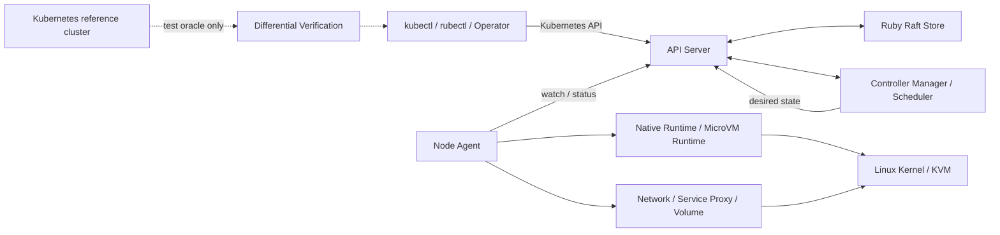

[仕様書の目次](../README.md) / [基礎](README.md)

# 3. アーキテクチャ

> 対象読者: アーキテクト、実装者、運用者
>
> 状態: 規範、版0.2

プロセスの構成、差し替えの境界、信頼の境界、プロセス間の通信を定義する。

図は[図00 全景](../diagrams/00-overview.md)にある。

## システムの全体像

## 3.1 プロセス構成

| プロセス | 役割 | 配置 |
|---|---|---|
| `apiserver` | REST API、認証と認可、admission、watchの配信 | 制御ノード |
| `controller-manager` | v1.36.2の組み込みコントローラ、動的コントローラ、リーダー選出 | 制御ノード |
| `scheduler` | Podのノードへの割り当て | 制御ノード |
| `agent` | Podのライフサイクル管理 | すべてのワーカーノード |
| `proxy` | Serviceのデータパス | すべてのワーカーノード |
| `rubectl` | kubectl互換の操作と、Ruby Manifest DSLのコンパイル | 任意 |

`apiserver`は内部にRaftノードを持つ。複数の制御ノードの間で合意を形成する。

## 3.2 差し替え境界

以下の境界をインターフェースとして定義する。本番経路に入る実装は自作実装と
明示的に許可した外部プラグインだけである。既存の同等実装は compatibility oracle として
テストプロセスから呼び、クラスタ本体へ組み込まない。

| 境界 | インターフェース | 本番実装 | テスト oracle |
|---|---|---|---|
| ストレージ | `Store` | Ruby `RaftStore`、Ruby `MemoryStore` | etcd の観測結果 |
| ランタイム | `Runtime` | Ruby `Native`、Ruby制御の `MicroVM` | runc/containerd の観測結果 |
| ネットワーク | `Network` | Ruby `Native` | CNI 実装の観測結果 |
| Volume | `Volume` | Ruby組込み実装、CSI互換プラグイン接続 | 既存 CSI 実装の観測結果 |

`etcd`、`runc`、`containerd`、`CRI-O`、既存 CNI、`kube-proxy`、`CoreDNS` は
本番クラスタの必須または代替実装として使用してはならない。

## 3.3 実装独立性と信頼境界

- Ruby が policy、状態機械、resource ownership、codec、controller、scheduler を保持する
- C 拡張は Ruby FFI で表現できない ABI の薄い shim に限定し、policy を実装してはならない
- 生成コードはスキーマ DSL から再生成可能でなければならず、手編集してはならない
- Linux kernel、CPU、KVM、Firecracker、jailer、guest kernel は MicroVM backend の TCB に含む
- Native backend は host kernel を共有するため、kernel compromise を隔離できるとは主張しない
- MicroVM backend は guest kernel compromise の封じ込めを目的とするが、VM escape 耐性の証明とは主張しない
- 形式検証の主張、実機で検査した主張、TCB に仮定した主張を混同してはならない

## 3.4 通信

| 経路 | プロトコル |
|---|---|
| CLI → apiserver | HTTP/1.1 + JSON。Kubernetes API 互換 |
| controller / scheduler → apiserver | 同上 |
| agent → apiserver | 同上。watch は chunked ストリーム |
| Raft ノード間 | 自作 RPC（[§5.3.6](../control-plane/raft.md#sec-5-3-6)） |

## Related

- [00 overview](../diagrams/00-overview.md)
- [Ruby Design index](../ruby/README.md)
- [Control Plane index](../control-plane/README.md)
- [Node index](../node/README.md)
