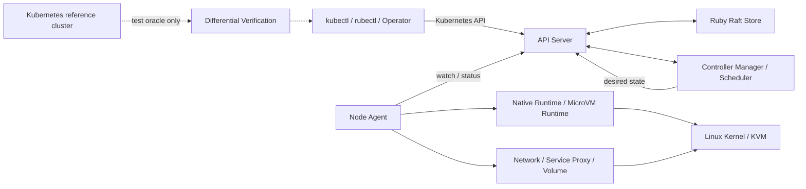

[仕様書の目次](../README.md) / [基礎](README.md)

# 3. アーキテクチャ

> 対象読者: アーキテクト、実装者、運用者
>
> 状態: 規範、版0.2

プロセスの構成、差し替えの境界、信頼の境界、プロセス間の通信を定義する。

図は[図00 全景](../diagrams/00-overview.md)にある。

## システムの全体像

## 3.1 プロセス構成

| プロセス | 役割 | 配置 |
|---|---|---|
| `apiserver` | REST API、認証と認可、admission、watchの配信 | 制御ノード |
| `controller-manager` | v1.36.2の組み込みコントローラ、動的コントローラ、リーダー選出 | 制御ノード |
| `scheduler` | Podのノードへの割り当て | 制御ノード |
| `agent` | Podのライフサイクル管理 | すべてのワーカーノード |
| `proxy` | Serviceのデータパス | すべてのワーカーノード |
| `rubectl` | kubectl互換の操作と、Ruby Manifest DSLのコンパイル | 任意 |

`apiserver`は内部にRaftノードを持つ。複数の制御ノードの間で合意を形成する。

## 3.2 差し替え境界

次の境界をインターフェースとして定義する。本番の経路に入る実装は、自作の実装と、明示的に許可した外部プラグインだけである。同等の機能を持つ既存の実装は、compatibility oracleとしてテストプロセスから呼ぶ。クラスタ本体には組み込まない。

| 境界 | インターフェース | 本番の実装 | テストでの比較対象 |
|---|---|---|---|
| ストレージ | `Store` | Rubyの`RaftStore`と`MemoryStore` | etcdの観測結果 |
| ランタイム | `Runtime` | Rubyの`Native`と、Rubyが制御する`MicroVM` | runcとcontainerdの観測結果 |
| ネットワーク | `Network` | Rubyの`Native` | CNI実装の観測結果 |
| ボリューム | `Volume` | Rubyの組み込み実装と、CSI互換プラグインへの接続 | 既存のCSI実装の観測結果 |

`etcd`、`runc`、`containerd`、`CRI-O`、既存のCNI、`kube-proxy`、`CoreDNS`を、本番クラスタの必須の実装として使ってはならない。代替の実装として使ってもならない。

## 3.3 実装の独立性と信頼境界

実装の独立性について、次のとおり定める。

- ポリシー、状態機械、資源の所有権、コーデック、コントローラ、スケジューラはRubyが保持する。
- C拡張は、RubyのFFIで表現できないABIを扱う薄いshimに限定する。C拡張にポリシーを実装してはならない。
- 生成コードは、スキーマDSLから再生成できなければならない。手で編集してはならない。

信頼境界について、次のとおり定める。

- Linux kernel、CPU、KVM、Firecracker、jailer、ゲストkernelは、MicroVM backendのTCBに含む。
- Native backendはホストのkernelを共有する。そのため、kernelが侵害された場合に隔離できるとは主張しない。
- MicroVM backendは、ゲストkernelが侵害された場合の封じ込めを目的とする。ただし、VM escapeへの耐性を証明したとは主張しない。
- 形式検証による主張、実機で検査した主張、TCBに仮定した主張を混同してはならない。

## 3.4 通信

| 経路 | プロトコル |
|---|---|
| CLIからapiserver | HTTP/1.1とJSON。Kubernetes API互換 |
| コントローラ、スケジューラからapiserver | 同上 |
| agentからapiserver | 同上。watchはchunkedのストリーム |
| Raftノード間 | 自作のRPC。[5.3.6](../control-plane/raft.md#sec-5-3-6)を参照 |

## 関連

- [00 overview](../diagrams/00-overview.md)
- [Ruby Design index](../ruby/README.md)
- [Control Plane index](../control-plane/README.md)
- [Node index](../node/README.md)
