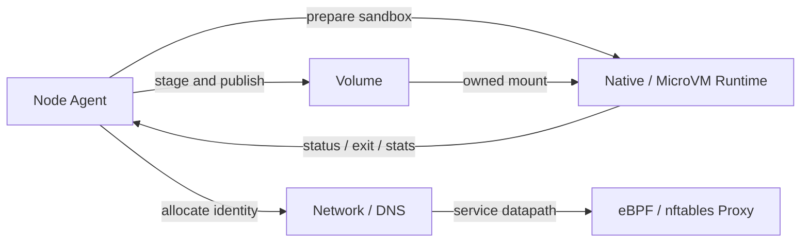

[仕様書インデックス](../README.md)

# Node and Workload Execution

> **Audience:** Node、Runtime、Network、Storage実装者、セキュリティ検証者

Podをnodeへ受け入れ、隔離環境、network、volumeを構築し、processまたはmicroVMとして
実行・監視・回収するdata planeを定義する。

## Lifecycle Flow

## Documents

| 文書 | 内容 |
|---|---|
| [Node Agent](node-agent.md) | SyncLoop、Pod起動、probe、restart、termination、eviction |
| [Runtime](runtime.md) | Native/MicroVM、状態機械、ownership、rollback、snapshot identity |
| [Network](network.md) | netlink、IPAM、overlay、NetworkPolicy、DNS |
| [Service Proxy](service-proxy.md) | Service、EndpointSlice、conntrack、eBPF/nftables |
| [Volume](volume.md) | built-in volume、CSI、lifecycle、projection、path security |

## Related

- [Node Agent図](../diagrams/04-node-agent.md)
- [Runtime図](../diagrams/05-runtime.md)
- [Runtime検証](../verification/testing.md#sec-8-7)

