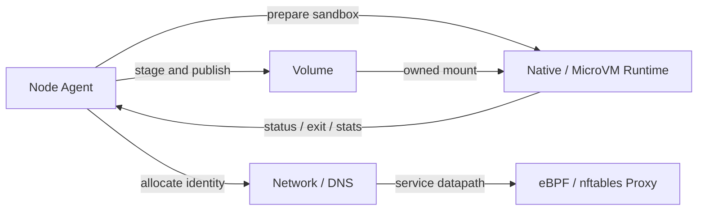

[仕様書の目次](../README.md)

# ノードとワークロードの実行

> 対象読者: ノード、ランタイム、ネットワーク、ストレージの実装者、セキュリティの検証者

データプレーンを定義する。データプレーンはPodをノードに受け入れ、隔離環境、ネットワーク、ボリュームを用意する。そのうえで、Podをプロセスまたはmicro VMとして実行し、監視し、回収する。

## ライフサイクルの流れ

## 文書

| 文書 | 内容 |
|---|---|
| [ノードエージェント](node-agent.md) | SyncLoop、Podの起動、probe、再起動、終了、eviction |
| [ランタイム](runtime.md) | NativeとMicroVM、状態機械、所有権、ロールバック、スナップショットのidentity |
| [ネットワーク](network.md) | netlink、IPAM、オーバーレイ、NetworkPolicy、DNS |
| [サービスプロキシ](service-proxy.md) | Service、EndpointSlice、conntrack、eBPFとnftables |
| [ボリューム](volume.md) | 組み込みのボリューム、CSI、ライフサイクル、投影、パスの安全性 |

## 関連

- [ノードエージェントの図](../diagrams/04-node-agent.md)
- [ランタイムの図](../diagrams/05-runtime.md)
- [ランタイムの検証](../verification/testing.md#sec-8-7)
