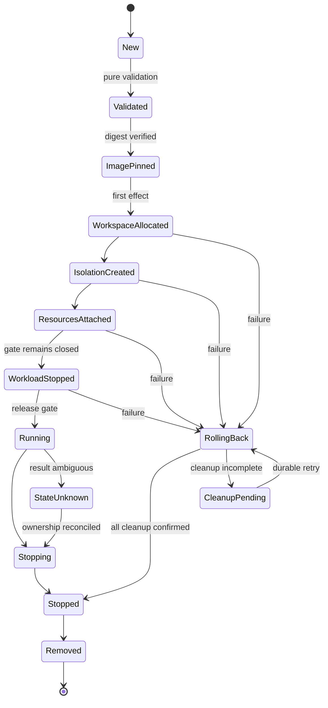

[仕様書の目次](../README.md) / [ノード](README.md)

<a id="sec-5-8"></a>
# 5.8 ランタイム

> 対象読者: ランタイムの実装者、セキュリティの検証者、形式検証の担当者
>
> 状態: 規範、版0.2

NativeとMicroVMの2つのランタイム、状態機械、資源の所有権、ロールバック、スナップショットのidentityを定義する。ランタイムは自作する。

図は[図05 ランタイム](../diagrams/05-runtime.md)にある。

<a id="sec-5-8-1"></a>
## 5.8.1 backendとRuntimeClass

`Runtime`は、ライフサイクルと資源の所有権を共通に持つ。backendごとに異なるのは隔離の仕組みだけである。本仕様では両方のbackendの実装を必須とする。

| RuntimeClassのhandler | backend | 隔離の単位 | 用途 | Pod overheadの既定値 |
|---|---|---|---|---|
| `rubernetes-native` | `Native` | Linuxのnamespaceとcgroup | 既定。Podと完全に互換 | 0 |
| `rubernetes-firecracker` | `MicroVM` | 1つのPodに1つのmicroVM | kernelの境界を追加する | CPU 50m、メモリ128Mi |
| `rubernetes-firecracker-restricted` | `MicroVMRestricted` | 1つのPodに1つのmicroVM。NICなし | brokerが許可した外部への作用だけを行う | CPU 50m、メモリ128Mi |

Podに`runtimeClassName`がなければ、`rubernetes-native`を使う。

次のいずれかに当たる場合は、Podを起動しない。Kubernetesと同じ`Failed`とEventを報告する。

- 指定されたRuntimeClassのhandlerが存在しない。
- ノードがそのbackendを提供していない。
- overheadを確保できない。

RuntimeClassのscheduling、nodeSelector、toleration、overheadは、admissionとスケジューラの両方で評価する。

Firecrackerは外部のVMMとして使う。ただし、次のものはRubyの実装が所有する。

- Podの解釈
- イメージの管理
- 状態機械
- ネットワーク
- ボリューム
- ポリシー
- ゲスト内のsupervisor
- 回収の判断

FirecrackerをNative backendの代わりとして扱ってはならない。本システムのコンテナライフサイクルの実装として扱ってもならない。

<a id="sec-5-8-2"></a>
## 5.8.2 インターフェース

```text
run_sandbox(config, runtime_class:)          → sandbox_id
stop_sandbox(id, timeout:)
remove_sandbox(id)
create_container(sandbox, spec)              → container_id
start_container(id)
stop_container(id, timeout:)
remove_container(id)
container_status(id)                         → status
exec(id, cmd, tty:)                          → stream
attach(id, tty:)                             → stream
logs(id, follow:, since:, tail:)             → stream
stats(id)                                    → stats
checkpoint_base(runtime_class:)              → snapshot_id
recover                                      → recovery_report
```

公開している操作はrequest IDを受け取り、冪等でなければならない。

timeoutは、呼び出し側が待つ時間の上限を表す。処理を放棄するという意味ではない。ランタイムは、操作の結果を耐久性のある台帳に確定させるまで、回復の処理を続ける。

<a id="sec-5-8-3"></a>
## 5.8.3 共通 lifecycle

Native と MicroVM は次の抽象状態機械を共有する。



- `Validated` までは filesystem、process、network、device、cgroup を変更してはならない
- `WorkloadStopped` までは workload code を 1 instruction も実行させない
- `Running` への遷移は image、volume、network、identity、policy の digest を照合した後の 1 回だけとする
- `StateUnknown` では start、resume、snapshot、resource reuse を禁止し、照合と cleanup だけを許可する
- 状態遷移は `{operation_id, from, to, owned_resources, config_digest}` として WAL に fsync する
- process crash 後は ledger と kernel/VMM の実状態を照合し、推測で成功状態へ進めてはならない

<a id="sec-5-8-4"></a>
## 5.8.4 resource ownership と rollback

各 sandbox は取得した resource を durable ledger で追跡する。

| resource | stable identity | 解放前条件 |
|---|---|---|
| process / microVM | pidfd、start time、executable digest | exit を pidfd で確認 |
| cgroup | cgroup ID と絶対 path | `cgroup.events populated=0` |
| namespace | namespace inode と保持 pidfd | 全参加 process の exit |
| mount | mount ID と target inode | 子 mount がない |
| network | netns inode、link ifindex、IP lease ID | workload process/VM の停止 |
| workspace | filesystem UUID、path、image digest | mount、mapper、process/VM の解放 |
| block mapping | dm UUID / loop device ID | consumer process/VM の停止 |
| jail root | inode、owner UID/GID | jailer/Firecracker の停止 |

resource は取得順に ledger へ追加し、失敗時は逆順で解放する。各 cleanup は冪等とし、
`not found` を成功として扱う前に stable identity の不一致がないことを確認する。上位 owner の
停止を確認できなければ、下位 resource を再利用・削除してはならない。cleanup 失敗は最初の
操作 error を置換せず、`cleanup_errors` としてすべて保持する。

<a id="sec-5-8-5"></a>
## 5.8.5 イメージ取得と固定

- OCI Distribution Spec と OCI Image Spec に従い registry と直接通信する
- tag は Pod 起動単位で digest へ 1 回だけ解決し、以後は digest を config fingerprint に固定する
- manifest、config、各 layer、署名、Firecracker binary、kernel、rootfs の SHA-256 を effect point 前に検証する
- layer は圧縮 stream と展開後の双方で上限を検査し、展開後 20 GiB、entry 1,000,000、path 長 4,096 byte を超えた image を拒否する
- `..`、absolute path、NUL、rootfs 外を指す symlink/hardlink を安全規則に従って拒否する。device node、FIFO、socket の entry は rootfs に作成せず skip して件数を記録する（container の `/dev` は runtime が nodev tmpfs 上に自ら構成する。containerd は node を作成するが、本実装は layer 全体を拒否せず entry のみ不採用とする）
- whiteout と opaque directory は OCI 規則に従い、各 pathname の適用時に rootfs 内であることを再認可する
- content-addressable store は digest を key とし、temporary file へ fsync 後に atomic rename する
- digest、署名、size、media type の不一致時は workspace 作成前に失敗させる

<a id="sec-5-8-6"></a>
## 5.8.6 Namespace

Native backend は `clone3(2)`、`unshare(2)`、`setns(2)` と pidfd を用いる。

| namespace | Pod 内共有 | Kubernetes field |
|---|---|---|
| Network | 共有 | `hostNetwork=true` では host に参加 |
| IPC | 共有 | `hostIPC=true` では host に参加 |
| UTS | 共有 | hostname/subdomain を設定 |
| PID | 既定は非共有 | `shareProcessNamespace=true` で Pod 内共有、`hostPID=true` で host に参加 |
| Mount | container ごと | volume だけを明示的に共有 |
| User | `hostUsers=false` の Pod 内で共有 | `hostUsers=true` または未指定では host user namespace |
| Cgroup | container ごとに private | cgroup path と host process を隠す |

namespace holder の mount namespace は host peer group の slave（`MS_SLAVE|MS_REC`、runc の既定）とし、
private にしてはならない。node agent は Pod root directory を shared な self bind mount にし、sandbox 作成後に
host 側で行う bind（container 起動時に解決する subPath）が holder と container の namespace に伝播するようにする。
holder 内の mount は host に伝播しない。

`hostUsers=false` では Pod ごとに重複しない 65,536 UID/GID range を永続割当し、
`setgroups=deny` の後に `uid_map` / `gid_map` を設定する。割当は sandbox identity と結び、
全 process の停止確認前に再利用してはならない。namespace holder は Ruby 製 sandbox init とし、
PID 1 の signal 処理と zombie 回収を行う。

<a id="sec-5-8-7"></a>
## 5.8.7 ファイルシステム

1. mount propagation を `MS_PRIVATE|MS_REC` にする
2. 検証済み image layer を read-only lowerdir、sandbox 固有領域を upperdir/workdir として OverlayFS を構築する
3. container 固有 mount namespace で `/proc`、`/sys`、`/dev`、`devpts`、`shm`、volume を構築する
4. `maskedPaths`、`readonlyPaths`、read-only rootfs、mountPropagation、subPath を適用する（subPath は kubelet の makeMounts と同じく、その container の起動時に解決・bind する。先行する init container が書き込む emptyDir 内の path を後続 container が subPath で参照できる）
5. `pivot_root` 後に旧 root を detach せず通常 umount し、到達不能を mount ID で確認する
6. 最後に executable、cwd、volume source が新 root 内にあることを fd based path resolution で再検査する

`chroot` を隔離境界として用いてはならない。path の認可後に pathname を再解決せず、
`openat2` の `RESOLVE_BENEATH|RESOLVE_NO_MAGICLINKS` と file descriptor を effect point まで保持する。

<a id="sec-5-8-8"></a>
## 5.8.8 cgroup v2

| 制御 | file / event |
|---|---|
| CPU | `cpu.max`、`cpu.weight`、`cpu.stat` |
| Memory | `memory.min`、`memory.low`、`memory.high`、`memory.max`、`memory.swap.max`、`memory.events` |
| I/O | `io.max`、`io.weight`、`io.stat` |
| Process | `pids.max`、`pids.current` |
| Placement | `cpuset.cpus`、`cpuset.mems` |
| Pressure | `cpu.pressure`、`memory.pressure`、`io.pressure` |

階層は `/sys/fs/cgroup/rubernetes/<qos>/<pod-uid>/<container-id>` とする。
QoS class、requests、limits、Pod overhead、init/sidecar resource semantics を v1.36.2 と同じ式で反映する。
limits 未指定時は該当 controller の hard limit を設定しない。process は workload gate を開く前に
対象 cgroup へ移動し、移動失敗時に実行してはならない。OOM は `memory.events` から取得し、
exit reason と Pod status へ一度だけ反映する。

<a id="sec-5-8-9"></a>
## 5.8.9 SecurityContext

`runAsUser`、`runAsGroup`、`supplementalGroups`、`fsGroup`、capabilities、`privileged`、
`allowPrivilegeEscalation`、seccomp、AppArmor、SELinux、procMount、readOnlyRootFilesystem を
v1.36.2 と同じ defaulting と validation で適用する。

security step は schema から依存 graph を生成し、namespace/mount 構築、group 設定、UID/GID 変更、
capability set、securebits、`no_new_privs`、LSM label、rlimit、seccomp、fd close、`execveat` の順序制約を
topological sort する。循環または kernel で実現できない組合せは process 作成前に拒否する。

seccomp の `RuntimeDefault` は arch ごとの allow-list BPF を Ruby で生成する。arch を先に検査し、
未知 syscall は `EPERM`、arch 不一致は process kill とする。`Unconfined` と `Localhost` profile は
Pod Security Admission と node policy が許可した場合だけ用いる。生成 BPF の意味保存は [§7.3](../verification/formal-methods.md#sec-7-3) で証明する。

<a id="sec-5-8-10"></a>
## 5.8.10 process 生成と監視

- `clone3` と `CLONE_PIDFD` で sandbox init/container process を生成し、数値 PID だけを identity に用いない
- 親子同期 pipe で child を workload gate 手前に停止し、親が mapping、cgroup、network、mount、policy を完了するまで待たせる
- `close_range` と allow-list で不要 fd を閉じ、stdin/stdout/stderr と明示 volume fd 以外を継承させない
- Entrypoint/Cmd、environment、cwd、user、group を確定後、検証済み fd に `execveat` する
- sandbox init は subreaper/PID 1 として signal 転送、zombie 回収、exit code 伝播を行う
- `exec`/`attach` は対象 sandbox namespace と cgroup に参加し、新しい security policy を同じ順序で適用する
- log は container ごとに 10 MiB × 5 file で rotation し、UTF-8 を仮定せず byte stream として保持する

<a id="sec-5-8-11"></a>
## 5.8.11 MicroVM 起動

MicroVM backend は 1 Pod を 1 Firecracker process と 1 guest kernel に対応付ける。
同一 Pod 内の container は相互信頼境界とみなし、同一 guest 内で [§5.8.6](runtime.md#sec-5-8-6)〜[§5.8.10](runtime.md#sec-5-8-10) の
container 隔離を Ruby guest supervisor が実行する。異なる Pod を同一 microVM に同居させてはならない。

起動前に Firecracker/jailer、guest kernel、read-only rootfs、dm-verity root hash、Ruby guest bundle の
digest と owner/mode を検証する。Firecracker は専用の非特権 UID/GID、private PID/mount/network namespace、
cgroup、default-deny seccomp、jailer chroot で起動する。jail input と親 directory は非特権 user が
書換不能でなければならない。

Ruby API client は Unix domain socket を用い、machine config、boot source、read-only verified rootfs、
writable workspace、vsock、network device、InstanceStart の固定順で設定する。HTTP header/body は各 64 KiB、
応答全体は 1 MiB を上限とし、duplicate Content-Length、Content-Length と Transfer-Encoding の併用、
不正 framing、未要求 response を拒否する。VM boot 完了だけで workload gate を開いてはならない。

`rubernetes-firecracker` は専用 TAP を guest の virtio-net へ接続し、[§5.9](network.md#sec-5-9) の Pod IP、route、DNS、
NetworkPolicy を適用する。Firecracker 自体に packet filter を委ねてはならない。
`rubernetes-firecracker-restricted` は network device を追加せず、[§5.8.13](runtime.md#sec-5-8-13) の broker だけを外部通信に使う。

<a id="sec-5-8-12"></a>
## 5.8.12 snapshot と identity

snapshot は Pod workload、Secret、ServiceAccount token、Pod IP、workspace を注入する前の
`WorkloadStopped` base image からだけ作成する。稼働 Pod の checkpoint/restore を snapshot cache として
用いてはならない。

snapshot 作成要求後、pause ACK の受信前に接続が失われた場合は `SnapshotPauseUnknown` とする。
この状態の VM を resume、snapshot 再試行、workspace 再利用してはならず、停止確認と cleanup だけを行う。
restore は `resume=false` で行い、次をすべて新規生成・再接続した後にだけ resume する。

- VM ID、Pod sandbox ID、subject ID、capability ID、request ID、vsock CID
- guest entropy、hostname、machine ID、network identity、Pod IP と route
- writable workspace、ConfigMap、Secret、ServiceAccount token、volume attachment
- policy digest、artifact digest、revocation epoch

guest supervisor は新しい identity と policy digest を受信し、旧 identity を破棄したことを署名付き ACK で返す。
host は ACK の VM identity、policy digest、nonce を照合するまで workload gate を開かない。

<a id="sec-5-8-13"></a>
## 5.8.13 guest-host protocol と restricted broker

vsock message は `[u32 big-endian length][canonical CBOR payload]` とし、length は確保前に検査する。
1 frame は 1 MiB、1 connection の未処理 request は 128、応答待ちは 30 秒を上限とする。
caller identity は payload の自己申告ではなく vsock connection、CID、runtime ledger から解決する。
guest image に host credential、registry credential、cluster administrator credential を保存してはならない。

restricted broker が公開できる operation は schema registry に登録した closed set に限る。
各 operation は effect point で capability、subject、object、parameters、expiry、revocation epoch、policy digest を
再認可する。DNS は全回答 IP が policy を満たさなければ全体を拒否し、HTTP redirect は hop ごとに
名前解決と認可をやり直す。未知 operation と未知 field は fail-closed する。

<a id="sec-5-8-14"></a>
## 5.8.14 crash recovery と安全不変条件

agent 起動時は新規 Pod を受理する前に runtime ledger、process、pidfd、cgroup、mount table、network link、
IP lease、dm/loop device、jail root、Firecracker socket を全走査する。ledger にだけ存在する resource、
kernel にだけ存在する orphan、identity が一致しない再利用 resource を区別し、監査記録を残して回収する。

次を Runtime の MUST 不変条件とする。

```text
LiveOwner(resource)  => not Released(resource)
Running(container)   => SandboxReady(container.sandbox)
DigestMismatch       => NoWorkloadEffect
State = Unknown      => NextAction in CleanupOrObserve
Restored(a, b)       => Identity(a) != Identity(b)
Stopped(sandbox)     => no LiveProcessOwnedBy(sandbox)
Removed(sandbox)     => OwnedResources(sandbox) = {}
```

これらは TLA+、Lean、property test、実機 fault injection の担当範囲を [§7](../verification/formal-methods.md#sec-7) と [§8](../verification/testing.md#sec-8) で分けて検証する。

## Related

- [node agent](node-agent.md)
- [network](network.md)
- [formal methods](../verification/formal-methods.md)
- [05 runtime](../diagrams/05-runtime.md)
