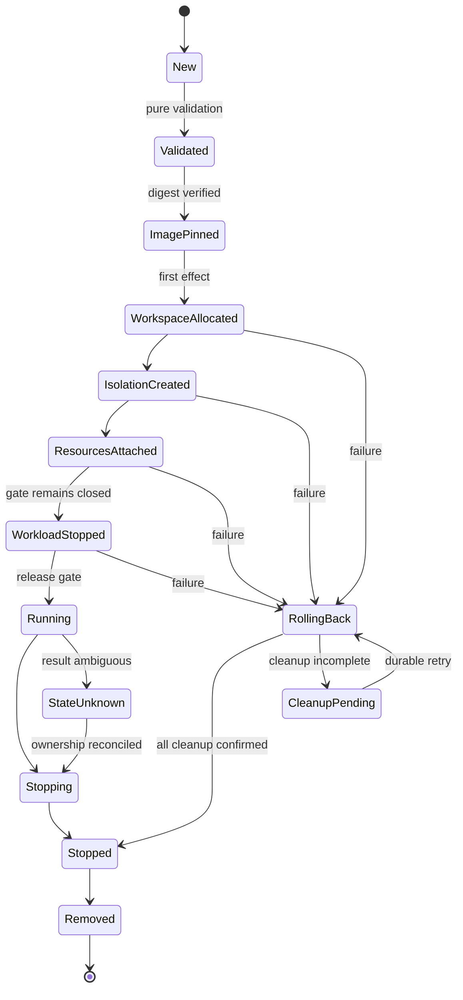

[仕様書の目次](../README.md) / [ノード](README.md)

<a id="sec-5-8"></a>
# 5.8 ランタイム

> 対象読者: ランタイムの実装者、セキュリティの検証者、形式検証の担当者
>
> 状態: 規範、版0.2

NativeとMicroVMの2つのランタイム、状態機械、資源の所有権、ロールバック、スナップショットのidentityを定義する。ランタイムは自作する。

図は[図05 ランタイム](../diagrams/05-runtime.md)にある。

<a id="sec-5-8-1"></a>
## 5.8.1 backendとRuntimeClass

`Runtime`は、ライフサイクルと資源の所有権を共通に持つ。backendごとに異なるのは隔離の仕組みだけである。本仕様では両方のbackendの実装を必須とする。

| RuntimeClassのhandler | backend | 隔離の単位 | 用途 | Pod overheadの既定値 |
|---|---|---|---|---|
| `rubernetes-native` | `Native` | Linuxのnamespaceとcgroup | 既定。Podと完全に互換 | 0 |
| `rubernetes-firecracker` | `MicroVM` | 1つのPodに1つのmicroVM | kernelの境界を追加する | CPU 50m、メモリ128Mi |
| `rubernetes-firecracker-restricted` | `MicroVMRestricted` | 1つのPodに1つのmicroVM。NICなし | brokerが許可した外部への作用だけを行う | CPU 50m、メモリ128Mi |

Podに`runtimeClassName`がなければ、`rubernetes-native`を使う。

次のいずれかに当たる場合は、Podを起動しない。Kubernetesと同じ`Failed`とEventを報告する。

- 指定されたRuntimeClassのhandlerが存在しない。
- ノードがそのbackendを提供していない。
- overheadを確保できない。

RuntimeClassのscheduling、nodeSelector、toleration、overheadは、admissionとスケジューラの両方で評価する。

Firecrackerは外部のVMMとして使う。ただし、次のものはRubyの実装が所有する。

- Podの解釈
- イメージの管理
- 状態機械
- ネットワーク
- ボリューム
- ポリシー
- ゲスト内のsupervisor
- 回収の判断

FirecrackerをNative backendの代わりとして扱ってはならない。本システムのコンテナライフサイクルの実装として扱ってもならない。

<a id="sec-5-8-2"></a>
## 5.8.2 インターフェース

```text
run_sandbox(config, runtime_class:)          → sandbox_id
stop_sandbox(id, timeout:)
remove_sandbox(id)
create_container(sandbox, spec)              → container_id
start_container(id)
stop_container(id, timeout:)
remove_container(id)
container_status(id)                         → status
exec(id, cmd, tty:)                          → stream
attach(id, tty:)                             → stream
logs(id, follow:, since:, tail:)             → stream
stats(id)                                    → stats
checkpoint_base(runtime_class:)              → snapshot_id
recover                                      → recovery_report
```

公開している操作はrequest IDを受け取り、冪等でなければならない。

timeoutは、呼び出し側が待つ時間の上限を表す。処理を放棄するという意味ではない。ランタイムは、操作の結果を耐久性のある台帳に確定させるまで、回復の処理を続ける。

<a id="sec-5-8-3"></a>
## 5.8.3 共通のライフサイクル

NativeとMicroVMは、次の抽象的な状態機械を共有する。



状態機械について、次のとおり定める。

- `Validated`までは、ファイルシステム、プロセス、ネットワーク、デバイス、cgroupを変更してはならない。
- `WorkloadStopped`までは、ワークロードのコードを1命令も実行させない。
- `Running`への遷移は1回だけとする。イメージ、ボリューム、ネットワーク、identity、ポリシーのダイジェストを照合したあとに行う。
- `StateUnknown`では、start、resume、スナップショット、資源の再利用を禁止する。許可するのは照合と後始末だけである。
- 状態の遷移は、`{operation_id, from, to, owned_resources, config_digest}`の形でWALにfsyncする。
- プロセスがクラッシュしたあとは、台帳と、kernelやVMMの実際の状態を照合する。推測で成功の状態に進めてはならない。

<a id="sec-5-8-4"></a>
## 5.8.4 資源の所有権とロールバック

各サンドボックスは、取得した資源を耐久性のある台帳で追跡する。

| 資源 | 安定したidentity | 解放の前提条件 |
|---|---|---|
| プロセス、microVM | pidfd、開始時刻、実行ファイルのダイジェスト | 終了をpidfdで確認している |
| cgroup | cgroup IDと絶対パス | `cgroup.events`が`populated=0`である |
| namespace | namespaceのinodeと、保持しているpidfd | 参加している全プロセスが終了している |
| マウント | マウントIDと、マウント先のinode | 子のマウントがない |
| ネットワーク | netnsのinode、リンクのifindex、IPリースのID | ワークロードのプロセスまたはVMが停止している |
| 作業領域 | ファイルシステムのUUID、パス、イメージのダイジェスト | マウント、mapper、プロセスまたはVMが解放されている |
| ブロックのマッピング | dmのUUID、loopデバイスのID | 利用しているプロセスまたはVMが停止している |
| jailのroot | inode、所有者のUIDとGID | jailerとFirecrackerが停止している |

資源は取得した順に台帳に追加する。失敗したときは逆の順に解放する。

後始末の各操作は冪等とする。`not found`を成功として扱う前に、安定したidentityが一致していることを確認する。

上位の所有者が停止したことを確認できない場合、下位の資源を再利用したり削除したりしてはならない。

後始末に失敗しても、最初の操作のエラーを置き換えない。後始末のエラーは、`cleanup_errors`としてすべて保持する。

<a id="sec-5-8-5"></a>
## 5.8.5 イメージの取得と固定

### 取得と検証

- OCI Distribution SpecとOCI Image Specに従い、レジストリと直接通信する。
- タグは、Podの起動ごとに1回だけダイジェストに解決する。以後は、そのダイジェストをconfig fingerprintに固定する。
- マニフェスト、config、各レイヤ、署名、Firecrackerのバイナリ、kernel、rootfsのSHA-256を、effect pointの前に検証する。
- ダイジェスト、署名、サイズ、media typeが一致しない場合は、作業領域を作る前に失敗させる。
- content-addressable storeは、ダイジェストをキーにする。一時ファイルにfsyncしたあと、atomicにrenameする。

### レイヤの展開

レイヤは、圧縮されたストリームと展開後の両方で上限を検査する。次の上限を超えたイメージは拒否する。

| 項目 | 上限 |
|---|---|
| 展開後の大きさ | 20 GiB |
| エントリの数 | 1,000,000 |
| パスの長さ | 4,096 byte |

次のエントリは、安全規則に従って拒否する。

- `..`を含むパス
- 絶対パス
- NULを含むパス
- rootfsの外を指すsymlinkとhardlink

デバイスノード、FIFO、socketのエントリは、rootfsに作らずに読み飛ばし、件数を記録する。コンテナの`/dev`は、ランタイムがnodevのtmpfsの上に自分で構成するためである。containerdはこれらのノードを作成する。本実装はレイヤ全体を拒否せず、該当するエントリだけを採用しない。

whiteoutとopaque directoryは、OCIの規則に従って処理する。各パス名を適用するときに、それがrootfsの中にあることを改めて確認する。

<a id="sec-5-8-6"></a>
## 5.8.6 namespace

Native backendは、`clone3(2)`、`unshare(2)`、`setns(2)`とpidfdを使う。

| namespace | Podの中での共有 | Kubernetesのフィールドとの関係 |
|---|---|---|
| Network | 共有する | `hostNetwork=true`ではホストのnamespaceに参加する |
| IPC | 共有する | `hostIPC=true`ではホストのnamespaceに参加する |
| UTS | 共有する | hostnameとsubdomainを設定する |
| PID | 既定では共有しない | `shareProcessNamespace=true`ではPodの中で共有する。`hostPID=true`ではホストのnamespaceに参加する |
| Mount | コンテナごとに持つ | ボリュームだけを明示的に共有する |
| User | `hostUsers=false`のPodの中で共有する | `hostUsers=true`または未指定の場合は、ホストのuser namespaceを使う |
| Cgroup | コンテナごとにprivateにする | cgroupのパスとホストのプロセスを隠す |

### マウントの伝播

namespaceを保持するプロセス（holder）のmount namespaceは、ホストのpeer groupのslaveとする。フラグは`MS_SLAVE|MS_REC`で、runcの既定と同じである。privateにしてはならない。

ノードエージェントは、Podのrootディレクトリを、sharedな自己bind mountにする。サンドボックスを作ったあとにホスト側で行うbindが、holderとコンテナのnamespaceに伝播するようにするためである。コンテナの起動時に解決するsubPathが、このbindに当たる。

holderの中で行ったマウントは、ホストには伝播しない。

### user namespace

`hostUsers=false`の場合は、Podごとに、重複しない65,536個のUIDとGIDの範囲を永続的に割り当てる。`setgroups=deny`を設定したあとで、`uid_map`と`gid_map`を設定する。

割り当てはサンドボックスのidentityに結び付ける。全プロセスの停止を確認するまで、再利用してはならない。

### holder

holderはRuby製のsandbox initとする。PID 1として、シグナルの処理とzombieの回収を行う。

<a id="sec-5-8-7"></a>
## 5.8.7 ファイルシステム

ファイルシステムは次の順に構築する。

1. マウントの伝播を`MS_PRIVATE|MS_REC`にする。
2. OverlayFSを構築する。検証済みのイメージレイヤを読み取り専用のlowerdirに、サンドボックス固有の領域をupperdirとworkdirにする。
3. コンテナ固有のmount namespaceの中で、`/proc`、`/sys`、`/dev`、`devpts`、`shm`、ボリュームを構築する。
4. `maskedPaths`、`readonlyPaths`、読み取り専用のrootfs、mountPropagation、subPathを適用する。
5. `pivot_root`のあと、古いrootをdetachせずに通常のumountで外す。到達できなくなったことをマウントIDで確認する。
6. 最後に、実行ファイル、cwd、ボリュームのマウント元が新しいrootの中にあることを、fdを使ったパス解決で再検査する。

subPathは、kubeletのmakeMountsと同じく、そのコンテナの起動時に解決してbindする。これにより、先に動くinitコンテナがemptyDirの中に作ったパスを、後続のコンテナがsubPathで参照できる。

`chroot`を隔離の境界として使ってはならない。

パスを認可したあとは、パス名を解決し直さない。`openat2`の`RESOLVE_BENEATH|RESOLVE_NO_MAGICLINKS`で得たファイルディスクリプタを、effect pointまで保持する。

<a id="sec-5-8-8"></a>
## 5.8.8 cgroup v2

| 制御 | ファイル、イベント |
|---|---|
| CPU | `cpu.max`、`cpu.weight`、`cpu.stat` |
| メモリ | `memory.min`、`memory.low`、`memory.high`、`memory.max`、`memory.swap.max`、`memory.events` |
| I/O | `io.max`、`io.weight`、`io.stat` |
| プロセス | `pids.max`、`pids.current` |
| 配置 | `cpuset.cpus`、`cpuset.mems` |
| pressure | `cpu.pressure`、`memory.pressure`、`io.pressure` |

階層は`/sys/fs/cgroup/rubernetes/<qos>/<pod-uid>/<container-id>`とする。

QoS class、requests、limits、Pod overhead、initコンテナとsidecarのリソースの意味論は、v1.36.2と同じ式で反映する。limitsが指定されていない場合、該当するcontrollerにはハードリミットを設定しない。

プロセスは、workload gateを開く前に対象のcgroupに移す。移動に失敗した場合は、実行してはならない。

OOMは`memory.events`から取得する。終了理由とPodのstatusには、1回だけ反映する。

<a id="sec-5-8-9"></a>
## 5.8.9 SecurityContext

次の項目を、v1.36.2と同じdefaultingとvalidationで適用する。

- `runAsUser`、`runAsGroup`、`supplementalGroups`、`fsGroup`
- capabilities
- `privileged`
- `allowPrivilegeEscalation`
- seccomp、AppArmor、SELinux
- procMount
- readOnlyRootFilesystem

### 適用の順序

セキュリティの各ステップは、スキーマから依存関係のグラフを生成し、トポロジカルソートで順序を決める。順序の制約がかかるステップは次のとおりである。

- namespaceとマウントの構築
- groupの設定
- UIDとGIDの変更
- capability set
- securebits
- `no_new_privs`
- LSMのラベル
- rlimit
- seccomp
- fdのclose
- `execveat`

依存関係が循環している組み合わせと、kernelで実現できない組み合わせは、プロセスを作る前に拒否する。

### seccomp

`RuntimeDefault`では、アーキテクチャごとの許可リストのBPFをRubyで生成する。BPFは最初にアーキテクチャを検査する。未知のシステムコールには`EPERM`を返す。アーキテクチャが一致しない場合はプロセスをkillする。

`Unconfined`と`Localhost`のプロファイルは、Pod Security Admissionとノードのポリシーが許可した場合だけ使う。

生成したBPFが意味を保存していることは、[7.3](../verification/formal-methods.md#sec-7-3)で証明する。

<a id="sec-5-8-10"></a>
## 5.8.10 プロセスの生成と監視

- sandbox initとコンテナのプロセスは、`clone3`と`CLONE_PIDFD`で生成する。数値のPIDだけをidentityとして使わない。
- 親子間の同期用パイプで、子をworkload gateの手前で止める。親がマッピング、cgroup、ネットワーク、マウント、ポリシーを完了するまで待たせる。
- `close_range`と許可リストで、不要なfdを閉じる。stdin、stdout、stderrと、明示したボリュームのfd以外は継承させない。
- Entrypoint、Cmd、環境変数、cwd、user、groupを確定したあと、検証済みのfdに対して`execveat`する。
- sandbox initは、subreaperとPID 1を兼ねる。シグナルの転送、zombieの回収、終了コードの伝播を行う。
- `exec`と`attach`は、対象のサンドボックスのnamespaceとcgroupに参加する。新しいプロセスにも、同じ順序でセキュリティポリシーを適用する。
- ログは、コンテナごとに10 MiBのファイルを5つまで保持し、ローテーションする。UTF-8であるとは仮定せず、バイト列として保持する。

<a id="sec-5-8-11"></a>
## 5.8.11 MicroVMの起動

### PodとVMの対応

MicroVM backendは、1つのPodを、1つのFirecrackerプロセスと1つのゲストkernelに対応付ける。異なるPodを同じmicroVMに同居させてはならない。

同じPodの中のコンテナどうしは、互いに信頼する境界の内側にあるとみなす。同じゲストの中で、Ruby製のゲストsupervisorが[5.8.6](runtime.md#sec-5-8-6)から[5.8.10](runtime.md#sec-5-8-10)までのコンテナ隔離を実行する。

### 起動前の検証

起動する前に、次のもののダイジェスト、所有者、モードを検証する。

- Firecrackerとjailer
- ゲストkernel
- 読み取り専用のrootfs
- dm-verityのroot hash
- Rubyのゲストbundle

Firecrackerは、次の制限のもとで起動する。

- 専用の非特権のUIDとGID
- privateなPID、mount、networkの各namespace
- cgroup
- default-denyのseccomp
- jailerによるchroot

jailへの入力とその親ディレクトリは、非特権のユーザが書き換えられない状態でなければならない。

### APIクライアント

RubyのAPIクライアントは、Unixドメインソケットを使う。設定は次の固定した順で行う。

1. machine config
2. boot source
3. 読み取り専用の検証済みrootfs
4. 書き込みできる作業領域
5. vsock
6. ネットワークデバイス
7. InstanceStart

`rubernetes-firecracker` は専用 TAP を guest の virtio-net へ接続し、[§5.9](network.md#sec-5-9) の Pod IP、route、DNS、
NetworkPolicy を適用する。Firecracker 自体に packet filter を委ねてはならない。
`rubernetes-firecracker-restricted` は network device を追加せず、[§5.8.13](runtime.md#sec-5-8-13) の broker だけを外部通信に使う。

<a id="sec-5-8-12"></a>
## 5.8.12 snapshot と identity

snapshot は Pod workload、Secret、ServiceAccount token、Pod IP、workspace を注入する前の
`WorkloadStopped` base image からだけ作成する。稼働 Pod の checkpoint/restore を snapshot cache として
用いてはならない。

snapshot 作成要求後、pause ACK の受信前に接続が失われた場合は `SnapshotPauseUnknown` とする。
この状態の VM を resume、snapshot 再試行、workspace 再利用してはならず、停止確認と cleanup だけを行う。
restore は `resume=false` で行い、次をすべて新規生成・再接続した後にだけ resume する。

- VM ID、Pod sandbox ID、subject ID、capability ID、request ID、vsock CID
- guest entropy、hostname、machine ID、network identity、Pod IP と route
- writable workspace、ConfigMap、Secret、ServiceAccount token、volume attachment
- policy digest、artifact digest、revocation epoch

guest supervisor は新しい identity と policy digest を受信し、旧 identity を破棄したことを署名付き ACK で返す。
host は ACK の VM identity、policy digest、nonce を照合するまで workload gate を開かない。

<a id="sec-5-8-13"></a>
## 5.8.13 guest-host protocol と restricted broker

vsock message は `[u32 big-endian length][canonical CBOR payload]` とし、length は確保前に検査する。
1 frame は 1 MiB、1 connection の未処理 request は 128、応答待ちは 30 秒を上限とする。
caller identity は payload の自己申告ではなく vsock connection、CID、runtime ledger から解決する。
guest image に host credential、registry credential、cluster administrator credential を保存してはならない。

restricted broker が公開できる operation は schema registry に登録した closed set に限る。
各 operation は effect point で capability、subject、object、parameters、expiry、revocation epoch、policy digest を
再認可する。DNS は全回答 IP が policy を満たさなければ全体を拒否し、HTTP redirect は hop ごとに
名前解決と認可をやり直す。未知 operation と未知 field は fail-closed する。

<a id="sec-5-8-14"></a>
## 5.8.14 crash recovery と安全不変条件

agent 起動時は新規 Pod を受理する前に runtime ledger、process、pidfd、cgroup、mount table、network link、
IP lease、dm/loop device、jail root、Firecracker socket を全走査する。ledger にだけ存在する resource、
kernel にだけ存在する orphan、identity が一致しない再利用 resource を区別し、監査記録を残して回収する。

次を Runtime の MUST 不変条件とする。

```text
LiveOwner(resource)  => not Released(resource)
Running(container)   => SandboxReady(container.sandbox)
DigestMismatch       => NoWorkloadEffect
State = Unknown      => NextAction in CleanupOrObserve
Restored(a, b)       => Identity(a) != Identity(b)
Stopped(sandbox)     => no LiveProcessOwnedBy(sandbox)
Removed(sandbox)     => OwnedResources(sandbox) = {}
```

これらは TLA+、Lean、property test、実機 fault injection の担当範囲を [§7](../verification/formal-methods.md#sec-7) と [§8](../verification/testing.md#sec-8) で分けて検証する。

## Related

- [node agent](node-agent.md)
- [network](network.md)
- [formal methods](../verification/formal-methods.md)
- [05 runtime](../diagrams/05-runtime.md)
