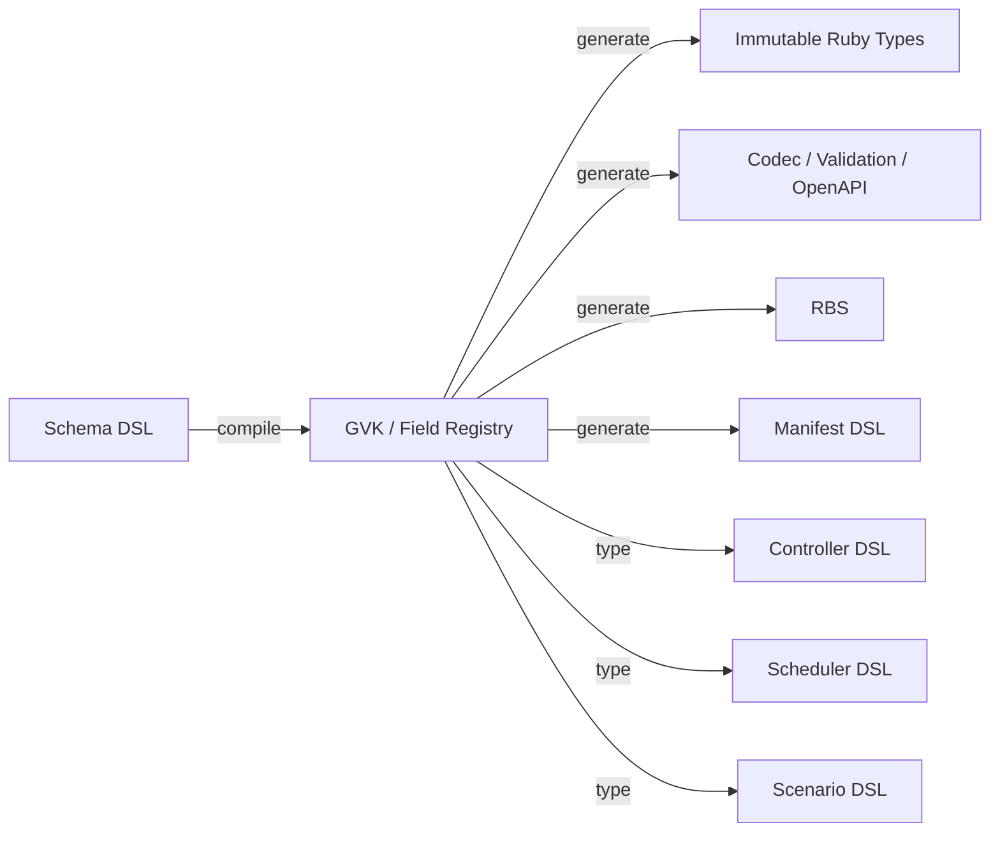

[仕様書の目次](../README.md)

# Rubyの言語設計

> 対象読者: Ruby実装者、DSL利用者、審査者

RubernetesはRubyを実装言語として使うだけではない。APIスキーマ、宣言、制御ループ、スケジューラ、障害シナリオを、1つの型付きメタプログラミングモデルにまとめる。

動的な機能は、実行時に自由に名前を解決するためには使わない。検査できるスキーマASTを入力にして、`define_method`で有限個のメソッドを生成するために使う。

## 生成モデル

## DSLの種類

| DSL | 定義している文書 | 生成するもの、保証するもの |
|---|---|---|
| Schema | [スキーマコンパイラ](schema-compiler.md) | 型、validator、コーデック、既定値、OpenAPI、RBS、diff |
| Manifest | [Manifest DSL](manifest-dsl.md) | 標準のKubernetes JSON。APIのワイヤ形式は変えない |
| Controller | [コントローラ](../control-plane/controllers.md#sec-5-5-8) | informer、インデックス、キュー、所有関係の配線 |
| Scheduler | [スケジューラ](../control-plane/scheduler.md#sec-5-6-6) | 型付きのFilterプラグインとScoreプラグイン |
| Scenario | [検証戦略](../verification/testing.md#sec-8-2) | 時系列での障害注入と、時相に関するアサーション |

## メタプログラミングの境界

- GVK、フィールド、プラグインを`method_missing`で解決しない。
- `define_method`を使うのは、スキーマコンパイラが所有する専用のModuleの中だけとする。
- 生成したメソッドの一覧、入力スキーマのダイジェスト、コンパイラのバージョン、生成物のダイジェストをマニフェストに記録する。
- 利用者が書いたRuby DSLは、クラスタの資格情報を持たない隔離プロセスで評価する。
- Leanから抽出したコードは本番の処理に使わない。Ruby実装を検査するテストの基準として使う。

## Related

- [Coding Standards](../delivery/coding-standards.md)
- [Kubernetes API](../api/kubernetes-api.md)
- [形式仕様](../verification/formal-methods.md)

