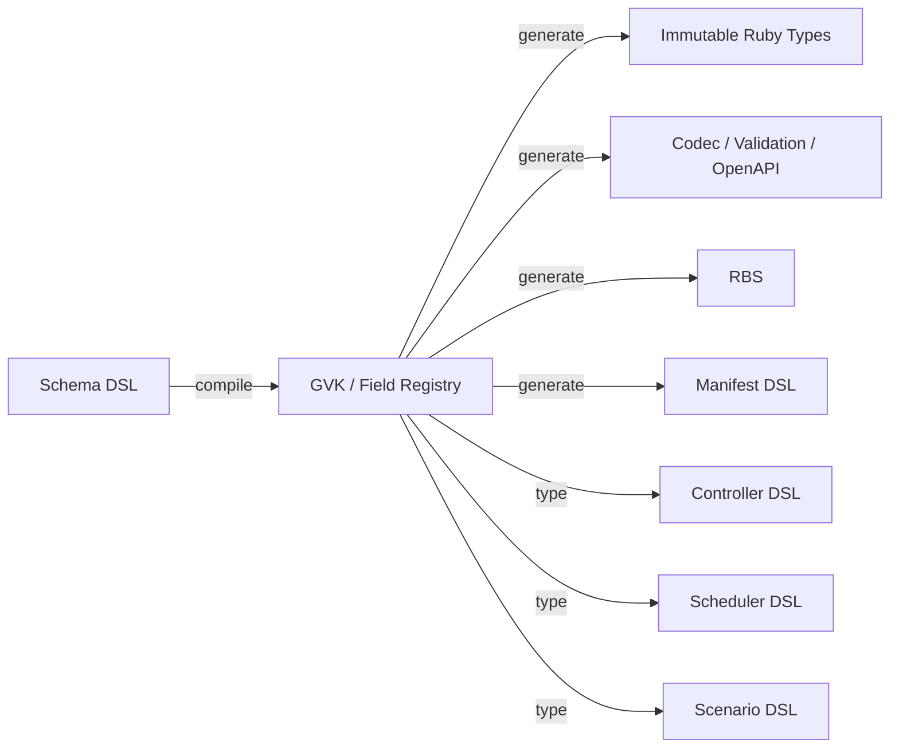

[仕様書の目次](../README.md)

# Rubyの言語設計

> 対象読者: Ruby実装者、DSL利用者、審査者

RubernetesはRubyを実装言語として使うだけではない。APIスキーマ、宣言、制御ループ、スケジューラ、障害シナリオを、1つの型付きメタプログラミングモデルにまとめる。

動的な機能は、実行時に自由に名前を解決するためには使わない。検査できるスキーマASTを入力にして、`define_method`で有限個のメソッドを生成するために使う。

## 生成モデル

## DSLの種類

| DSL | 定義している文書 | 生成するもの、保証するもの |
|---|---|---|
| Schema | [Schema Compiler](schema-compiler.md) | type、validator、codec、default、OpenAPI、RBS、diff |
| Manifest | [Manifest DSL](manifest-dsl.md) | 標準Kubernetes JSON。API wire formatは変更しない |
| Controller | [Controllers](../control-plane/controllers.md#sec-5-5-8) | Informer、index、queue、ownershipの配線 |
| Scheduler | [Scheduler](../control-plane/scheduler.md#sec-5-6-6) | 型付きFilter/Score plugin |
| Scenario | [検証戦略](../verification/testing.md#sec-8-2) | 時系列障害注入と時相assertion |

## Metaprogramming Boundary

- `method_missing`でGVK、field、pluginを解決しない。
- `define_method`はschema compilerが所有する専用Moduleに限定する。
- 生成method一覧、入力schema digest、compiler version、生成物digestをmanifest化する。
- user supplied Ruby DSLはcluster credentialを持たない隔離processで評価する。
- Lean抽出コードを本番処理にせず、Ruby実装のtest oracleとして使う。

## Related

- [Coding Standards](../delivery/coding-standards.md)
- [Kubernetes API](../api/kubernetes-api.md)
- [形式仕様](../verification/formal-methods.md)

