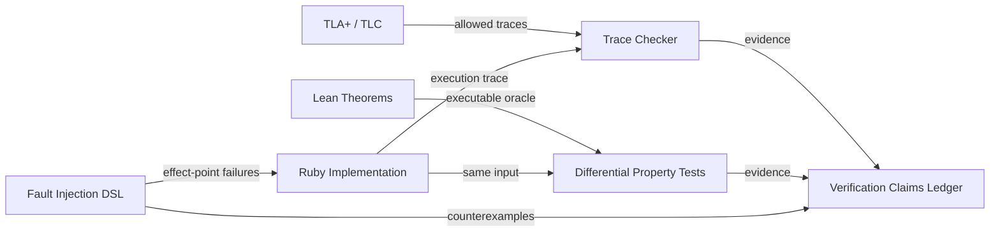

[仕様書の目次](../README.md)

# 検証

> 対象読者: 形式検証の担当者、テストの実装者、セキュリティの検証者、審査者

検証には、TLA+、Lean、property test、差分テスト、Kubernetes Conformance、実際のkernelとKVMを使うゲートを組み合わせる。それぞれの主張について、保証のレベルとTCBを明示する。

## Verification Bridge

## Documents

| 文書 | 内容 |
|---|---|
| [形式仕様](formal-methods.md) | TLA+/Lean分担、定理、禁止事項、保証レベル台帳 |
| [検証戦略](testing.md) | test階層、障害DSL、線形化、差分、Runtime L0〜L5 |
| [Kubernetes互換性試験](kubernetes-compatibility.md) | upstream Conformance/e2e、client/project corpus、zero-skip release gate |

## Related

- [Verification図](../diagrams/08-verification.md)
- [Runtime](../node/runtime.md)
- [マイルストーン](../delivery/milestones.md)
- [Release Gate](../delivery/implementation-plan.md#sec-9-3)
