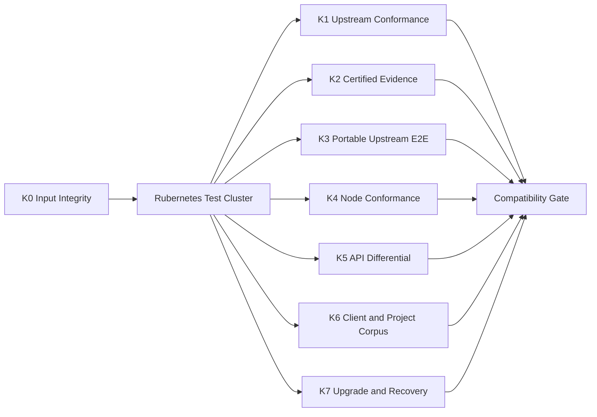

[仕様書の目次](../README.md) / [検証](README.md)

<a id="kubernetes-compatibility"></a>
# Kubernetes v1.36.2互換性試験契約

> 対象読者: 互換性の検証者、CIの実装者、リリース担当者、APIとノードの実装者
>
> 状態: 規範、版0.2

Kubernetesのupstreamテストを、改変せずにRubernetesへ接続する方法を定義する。あわせて、テストを選択する規則、実行するプロファイル、証拠の形式、完全互換を名乗るためのゲートを定める。ゲートは失敗ゼロを要求する。

Kubernetes Conformanceは、最初に通過しなければならないゲートである。ただし、Conformanceに通るだけでは完全な互換性は示せない。[マイルストーンM8](../delivery/milestones.md#milestone-m8)を完了するには、次のすべてを通過する必要がある。

- Conformance
- 可搬なupstreamのe2e
- Node Conformance
- APIの差分テスト
- クライアントのバージョン差の検査
- 実在するプロジェクトのコーパス

## 固定するupstreamの入力

| 入力 | 変更できない識別子 | 用途 |
|---|---|---|
| Kubernetesのソース | タグ`v1.36.2`、コミット`24e2b02af5543d7910c2bb074c7264df5a8f0467` | e2eのソース、テストのメタデータ、APIの比較対象 |
| Conformanceの定義 | 446件、SHA-256 `cdbad746df8e8f5f7e63ef147b579e921c1ad70a68d826f2b9c5af27dbbf7641` | 必須テストの一覧 |
| Conformanceイメージ | `registry.k8s.io/conformance@sha256:e86cfc45351bd6937c4744477a204130af2c822682b79465490d1cd2d1f7c246` | 公式の`e2e.test`とGinkgoを実行するイメージ |
| Hydrophone | `v0.7.0`、コミット`3de3e886a2f6f09635d8b981c195490af1584d97` | 軽量な直接実行ランナー |
| Sonobuoy | `v0.57.5`、コミット`310c51d9874a4d10d021ec8a19f8b42292ec0bfc` | CNCFのcertified-conformance形式の証拠 |

アーキテクチャ別のイメージのダイジェスト、ランナーのアーカイブのチェックサム、補助イメージのダイジェストは、[`third_party/locks/`](../../third_party/locks/README.md)を機械可読な正本とする。

次のものだけをリリースの入力にしてはならない。

- タグの文字列
- ブランチの先頭
- `latest`
- レジストリのタグを解決し直した結果

テストイメージが内部で参照するコンテナイメージは、実行を始める前にすべて列挙する。レジストリのマニフェストのダイジェストを`resolved-images.json`に固定する。テストの実行中に同じタグのダイジェストが変わった場合、その実行は無効とする。

## 検査の段階

検査はK0からK7までの8段階に分かれる。



| 段階 | 検査の内容 | 要求する結果 |
|---|---|---|
| K0 | ロック、署名、ダイジェスト、ソースに変更がないこと | 不一致が0、解決できない入力が0 |
| K1 | upstreamの`[Conformance]`446件 | プロファイルごとに合格446、失敗・スキップ・flakeが0 |
| K2 | Sonobuoyの`certified-conformance` | CNCF形式で必須テストの欠落が0、失敗が0 |
| K3 | upstreamの可搬なLinux e2e | 対象のテストが100%合格、未分類が0 |
| K4 | upstreamのNode Conformance | amd64で失敗が0、想定外のスキップが0 |
| K5 | API、スキーマ、ワイヤ形式の差分テスト | 操作、状態、エラーの差分が0 |
| K6 | kubectl、client-go、Helm、Kustomize、プロジェクトのコーパス | サポートする組み合わせで失敗が0、プロジェクトへの変更が0 |
| K7 | インストール、アップグレード、ロールバック、再起動、バックアップ、リストア | データの喪失が0、止まったままの操作が0 |

## クラスタのプロファイル

K1は、[`test/conformance/kubernetes/profiles.yml`](../../test/conformance/kubernetes/profiles.yml)にあるx86_64の3つのプロファイルをすべて実行する。各プロファイルは、制御ノード3台と、スケジュール可能なワーカーノード3台を持つ。構成するのは、minorとpatchが同じRubernetesのコンポーネントだけである。

| アーキテクチャ | ネットワーク | ランタイム | M8に必要な実行 |
|---|---|---|---:|
| amd64 | IPv4 | Native | 連続3回の問題のない実行 |
| amd64 | IPv6 | Native | 連続3回の問題のない実行 |
| amd64 | IPv4とIPv6のdual-stack | Native | 連続3回の問題のない実行 |

ARMのプロファイルは、任意の追加試験として実行できる。M8とM9の完了の証拠としては要求しない。

K1では、既定のRuntimeClassを変更せずにupstreamのテストを実行する。

MicroVMとMicroVMRestrictedは、プロジェクトが書いたe2eで検査する。このe2eはPodのspecにRuntimeClassを明示し、同じPod APIの契約を確かめる。あわせて、[ランタイムのL4とL5](testing.md#sec-8-7)とM7を通過する。

upstreamのソースにRuntimeClassを注入する変更を加えた実行は、K1とK2の証拠に数えてはならない。

## K0 入力の整合性

Rubyのランナー`tools/conformance/run.rb`は、クラスタに接続する前に次の項目を検査する。

1. Kubernetesのタグオブジェクトと、タグが指すコミットが、ロックと一致する。
2. チェックアウトしたソースに変更がない。追跡しているファイルにも、追跡していないファイルにも変更がなく、submoduleとvendorのツリーが固定した状態にある。
3. `conformance.yaml`が正しい。確認する内容は下の「conformance.yamlの検査」に示す。
4. ランナーのアーカイブ、ランナーのイメージ、Conformanceイメージ、補助イメージのダイジェストがロックと一致する。
5. 対象のアーキテクチャ用のマニフェストがインデックスの中にある。別のアーキテクチャで代用しない。
6. KUBECONFIGがRubernetesのクラスタだけを指している。比較対象のKubernetesクラスタと資格情報を共有していない。
7. テストの実行ID、クラスタID、ソースのコミット、プロファイル、解決したイメージの集合を、変更できないマニフェストに記録する。

いずれかが一致しない場合は、テストの失敗として扱う。ネットワークから取得した値でロックを自動的に更新してはならない。

### conformance.yamlの検査

次の3点を確認する。

- SHA-256がロックと一致する。
- エントリが446件ある。
- `codename`が446件あり、重複がない。

一意なキーは`codename`である。JUnitの結果との結合にも`codename`を使う。

`testname`に重複がないことを要求してはならない。v1.36.2のupstreamの定義では、446件のエントリに対して、異なる`testname`は436件しかない。`MutatingAdmissionPolicy`など10件の読みやすい名前を、複数のテストが共有しているためである。

## K1 upstreamのConformance

正規の実行にはHydrophoneを使う。Rubyのランナーは、次と同じ意味の引数で`execve`する。

```bash
hydrophone \
  --kubeconfig artifacts/kubeconfig \
  --conformance \
  --conformance-image registry.k8s.io/conformance@sha256:e86cfc45351bd6937c4744477a204130af2c822682b79465490d1cd2d1f7c246 \
  --busybox-image registry.k8s.io/e2e-test-images/busybox@sha256:a9155b13325b2abef48e71de77bb8ac015412a566829f621d06bfae5c699b1b9 \
  --parallel 1 \
  --output-dir artifacts/conformance
```

`--focus`には、Hydrophoneの`--conformance`が設定する`[Conformance]`だけを使う。`--skip`は渡さない。

タイムアウト、並列数、テストの順序を変えた実行は、別の実行として扱う。失敗した実行の置き換えには使えない。

JUnitとGinkgoのJSONを、`conformance.yaml`の`codename`で結合する。そのうえで次の項目を検査する。

- 446件の`codename`が、それぞれちょうど1回ずつ選択されている。
- 合格が446、失敗が0、スキップが0、pendingが0、中断が0である。
- スイートのsetupとteardownの失敗、namespaceの後始末の失敗、ログ収集の失敗が0である。
- 実行の前後で、テスト用のnamespace、クラスタスコープのfixture、Pod、ボリューム、ネットワークの資源が残っていない。
- 同じプロファイルで3回続けて問題のない実行になるまで、M8の証拠を確定しない。

途中で失敗したテストだけを再実行して成功しても、元の実行を成功に書き換えてはならない。失敗の原因を修正した新しいコミットで、スイート全体を最初から実行する。

## K2 certified-conformanceの証拠

CNCFへの提出形式を独立に確認するために、Sonobuoyを使う。Rubyのランナーは、次と同じ意味の引数で実行する。

```bash
sonobuoy run \
  --mode=certified-conformance \
  --kubeconfig artifacts/kubeconfig \
  --kubernetes-version=v1.36.2 \
  --kube-conformance-image=registry.k8s.io/conformance@sha256:e86cfc45351bd6937c4744477a204130af2c822682b79465490d1cd2d1f7c246 \
  --sonobuoy-image=sonobuoy/sonobuoy@sha256:7a65a613a53017dfbe674f61890f8f5b16b4a8085286f625eeb42b6ae64c48b8 \
  --wait
```

次のものは禁止する。

- `certified-conformance`以外のmode
- `E2E_SKIP`
- skip用の正規表現の追加
- focusでテストを絞ること

リリースの証拠には、Sonobuoyのアーカイブ全体を保存する。少なくとも、`e2e.log`、`junit_01.xml`、実行したコマンド、解決したイメージのダイジェスト、クラスタのプロファイルを含める。

## K3 可搬なupstreamのLinux e2e

Conformance以外も含むupstreamの`test/e2e`を、v1.36.2のソースからビルドする。provider `skeleton`でRubernetesに接続する。upstreamのソースと、生成したテストバイナリを変更してはならない。

### テストの分類

Ginkgoのdry-runで得たテストの一覧について、すべてのテストを次のどれか1つに分類する。

| 分類 | 意味 | M8での扱い |
|---|---|---|
| `required` | Linuxクラスタの公開APIか、外部から観測できる挙動を検査する | 必ず実行して合格させる |
| `platform-inapplicable` | `[WindowsOnly]`のように、明示されたLinux以外のプラットフォームだけを検査する | 除外できる |
| `provider-private` | 特定のクラウドのアカウント、ハードウェア、プロバイダ独自のAPIがなければ成立しない | 契約を確かめるテストに置き換えたうえで除外できる |
| `implementation-internal` | Kubernetesのプロセスのパス、Go内部のメトリクス、etcdの直接操作など、実装が一致することを要求する | 外部から見た挙動のテストに置き換えたうえで除外できる |

次のタグは、除外の理由にならない。

- `[LinuxOnly]`
- `[Disruptive]`
- `[Slow]`
- `[Serial]`
- `[Flaky]`
- `[Feature:*]`

未実装、失敗、タイムアウト、環境構築の難しさも、除外の理由にならない。

`required`以外に分類した項目は、`selection-ledger.json`に記録する。記録する内容は、upstreamのテストID、ファイル、分類の理由、外部契約の有無、置き換えたテストのID、レビュアである。

`provider-private`または`implementation-internal`に分類した項目に、外部から観測できる契約がある場合がある。その場合は、同じ入力と同じ観測点を持つプロジェクト作成のテストが合格するまで、その項目を完了にしてはならない。

未分類の件数と、置き換えのテストが接続されていない件数は、どちらも0でなければならない。

## K4 Node Conformance

upstreamのNode Conformanceを、実際のkernelで動くamd64のノードに対して実行する。

ノードエージェントは、Kubernetesが公開している次の挙動を提供する。

- ノードの登録
- Podのライフサイクル
- probe
- log
- exec
- リソースの隔離
- statusの報告

テストが、kubelet固有の非公開のパスやプロセス名を要求する場合は、K3と同じ台帳で分類する。その場合、外部契約はランタイムのL3とL5のテストに置き換える。

次のテストは、Node Conformanceの証拠に数えない。

- モックのランタイムを使ったテスト
- 偽のcgroupを使ったテスト
- network namespaceを持たないコンテナの中でのテスト

## K5 APIとワイヤ形式の差分

同じseedから作った要求の列を、Kubernetes v1.36.2のクラスタとRubernetesのクラスタに与える。次の観測結果を正規化して比較する。

- discovery、OpenAPI、protobufのディスクリプタ、content negotiation
- 成功時とエラー時のHTTPステータス、ヘッダ、`Status.reason`、`Status.details`、`Status.causes`
- defaulting、validation、conversion、pruning、admissionの結果
- JSON、YAML、Protobuf、CBOR、watch、exec、attach、port-forwardのフレーミング
- patchとapplyの結果、managedFields、競合、resourceVersionの因果の順序
- コントローラ、スケジューラ、ノードが出すイベントの列と、最終的なクラスタの状態

UID、タイムスタンプ、乱数の値、ノード固有のアドレスは、値が一致することを要求しない。形式、一意性、単調性、因果関係を比較する。

結果が一致しなかった場合は、自動的に最小の例まで縮める。要求の列、両方の応答、両方のトレースを、回帰用のfixtureとして固定する。

## K6 クライアントと既存プロジェクトのコーパス

### クライアントの組み合わせ

対象のAPIサーバ1.36に対して、公開済みのkubectlのminorバージョンをすべて試す。対象は、Kubernetesのversion-skew policyが許す範囲である。

Kubernetes v1.36.2互換state formatを保ったまま、single-nodeから3-node、MemoryStoreからRaftStore、
旧Rubernetes releaseから1.0.0へupgradeする。各段階でK1 smoke subsetとK5 state comparisonを実行する。

upgrade、rollback、API Server rolling restart、controller/scheduler leader loss、worker reboot、
backup/restore後に、acknowledged object、managedFields、UID ownership、Volume attachment、Pod identityを失わない。
rollback不能なstorage migrationをrelease artifactへ含めてはならない。

## Evidence Manifest

各runは次の最小JSON Schemaを満たす`manifest.json`を生成する。

```json
{
  "$schema": "https://json-schema.org/draft/2020-12/schema",
  "type": "object",
  "required": ["schemaVersion", "suite", "sourceCommit", "rubernetesCommit", "profile", "inputsLock", "summary", "artifacts"],
  "properties": {
    "schemaVersion": {"const": 1},
    "suite": {"const": "K1-upstream-conformance"},
    "sourceCommit": {"const": "24e2b02af5543d7910c2bb074c7264df5a8f0467"},
    "rubernetesCommit": {"type": "string", "pattern": "^[0-9a-f]{40}$"},
    "profile": {"type": "string", "minLength": 1},
    "inputsLock": {"const": "third_party/locks/kubernetes-v1.36.2.json"},
    "summary": {
      "type": "object",
      "required": ["selected", "passed", "failed", "skipped", "flaked"],
      "properties": {
        "selected": {"const": 446},
        "passed": {"const": 446},
        "failed": {"const": 0},
        "skipped": {"const": 0},
        "flaked": {"const": 0}
      },
      "additionalProperties": false
    },
    "artifacts": {
      "type": "array",
      "minItems": 2,
      "items": {
        "type": "object",
        "required": ["path", "sha256"],
        "properties": {
          "path": {"type": "string", "minLength": 1},
          "sha256": {"type": "string", "pattern": "^[0-9a-f]{64}$"}
        },
        "additionalProperties": false
      }
    }
  },
  "additionalProperties": true
}
```

raw log、JUnit、Ginkgo JSON、cluster event、component log、
resolved image list、resource inventoryをrun IDで結び、release後も再検証可能な保存先へ配置する。

## CI Scheduling

| Trigger | Required lanes |
|---|---|
| Pull request | K0、変更componentのunit/property/integration、K5 affected corpus |
| Merge to main | K0、single-profile K1、K3 affected shard、K5、K6 affected project |
| Nightly | 3 x86_64 profile K1をrotation、K3全shard、K4、K5、K6、K7 recovery subset |
| Milestone M8 candidate | K0〜K7全体、3 x86_64 profile × 3 consecutive K1、K2 |
| Release M9 | M8全体をrelease commitとrelease artifactで再実行 |

test shardingは許可するが、selection ledgerと全shardのunionがrequired inventoryと一致しなければならない。
cancelled shard、missing result、artifact upload failureはsuite failureとして扱う。

## Primary Sources

- [Kubernetes v1.36.2 source](https://github.com/kubernetes/kubernetes/tree/v1.36.2)
- [v1.36.2 Conformance definition](https://github.com/kubernetes/kubernetes/blob/v1.36.2/test/conformance/testdata/conformance.yaml)
- [CNCF Conformance instructions](https://github.com/cncf/k8s-conformance/blob/691d9b951a75accf18dfc29b811a3947db874081/instructions.md)
- [Hydrophone](https://github.com/kubernetes-sigs/hydrophone)
- [Kubernetes version-skew policy](https://kubernetes.io/releases/version-skew-policy/)
- [Kubernetes Node Conformance](https://kubernetes.io/docs/setup/best-practices/node-conformance/)

## Related

- [検証戦略](testing.md)
- [形式仕様](formal-methods.md)
- [マイルストーン](../delivery/milestones.md)
- [Project Structure](../delivery/project-structure.md)
- [規範参照](../references.md)
