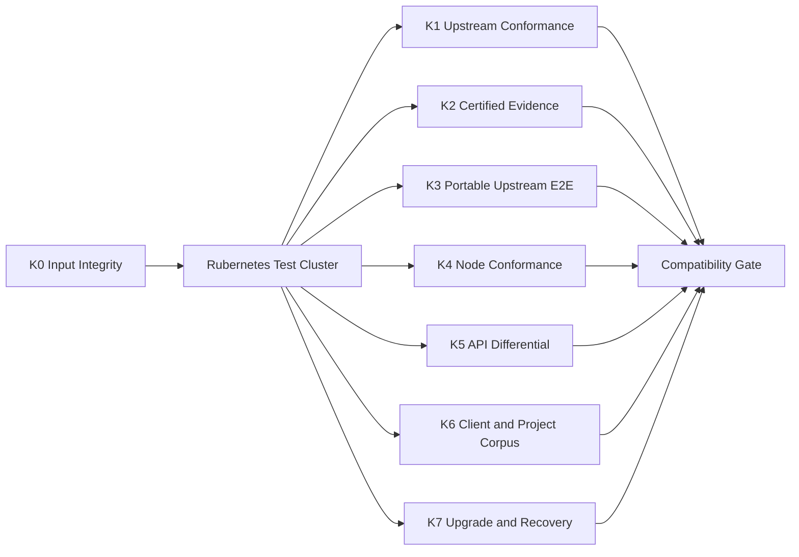

[仕様書の目次](../README.md) / [検証](README.md)

<a id="kubernetes-compatibility"></a>
# Kubernetes v1.36.2互換性試験契約

> 対象読者: 互換性の検証者、CIの実装者、リリース担当者、APIとノードの実装者
>
> 状態: 規範、版0.2

Kubernetesのupstreamテストを、改変せずにRubernetesへ接続する方法を定義する。あわせて、テストを選択する規則、実行するプロファイル、証拠の形式、完全互換を名乗るためのゲートを定める。ゲートは失敗ゼロを要求する。

Kubernetes Conformanceは必須の第1gateだが、完全な互換性の十分条件ではない。
Conformance、portable upstream e2e、Node Conformance、API differential、client version skew、
実project corpusをすべて通過して初めて[Milestone M8](../delivery/milestones.md#milestone-m8)を完了できる。

## Pinned Upstream Inputs

| Input | Immutable identity | Purpose |
|---|---|---|
| Kubernetes source | tag `v1.36.2` → commit `24e2b02af5543d7910c2bb074c7264df5a8f0467` | e2e source、test metadata、API oracle |
| Conformance definition | 446 tests、SHA-256 `cdbad746df8e8f5f7e63ef147b579e921c1ad70a68d826f2b9c5af27dbbf7641` | required test inventory |
| Conformance image | `registry.k8s.io/conformance@sha256:e86cfc45351bd6937c4744477a204130af2c822682b79465490d1cd2d1f7c246` | official `e2e.test`/Ginkgo execution image |
| Hydrophone | `v0.7.0`、commit `3de3e886a2f6f09635d8b981c195490af1584d97` | lightweight direct runner |
| Sonobuoy | `v0.57.5`、commit `310c51d9874a4d10d021ec8a19f8b42292ec0bfc` | CNCF certified-conformance形式のevidence |

architecture別image digest、runner archive checksum、support image digestは
[`third_party/locks/`](../../third_party/locks/README.md)をmachine-readable source of truthとする。
tag文字列だけ、branch head、`latest`、registry tagの再解決結果だけをrelease inputにしてはならない。

test imageが内部で参照する全container imageはrun開始前に列挙し、registry manifest digestを
`resolved-images.json`へ固定する。test実行中に同じtagのdigestが変化した場合、そのrunは無効とする。

## Verification Lanes



| Lane | Suite | Required result |
|---|---|---|
| K0 | lock、signature、digest、source cleanliness | mismatch 0、unresolved input 0 |
| K1 | upstream `[Conformance]` 446 tests | profileごとにpass 446、fail/skip/flake 0 |
| K2 | Sonobuoy `certified-conformance` | CNCF形式のrequired test欠落0、failure 0 |
| K3 | upstream portable Linux e2e | eligible test pass 100%、unclassified 0 |
| K4 | upstream Node Conformance | amd64でfailure 0、unexpected skip 0 |
| K5 | API/schema/wire differential | operation/state/error差分0 |
| K6 | kubectl/client-go/Helm/Kustomize/project corpus | supported matrixのfailure 0、project patch 0 |
| K7 | install/upgrade/rollback/restart/backup/restore | data loss 0、stuck operation 0 |

## Cluster Profiles

K1は[`test/conformance/kubernetes/profiles.yml`](../../test/conformance/kubernetes/profiles.yml)の
3 x86_64 profileをすべて実行する。各profileは3 control node、3 schedulable worker nodeを持ち、
同一minor/patchのRubernetes componentだけで構成する。

| Architecture | Network | Runtime | Runs required for M8 |
|---|---|---|---:|
| amd64 | IPv4 | Native | consecutive clean runs 3 |
| amd64 | IPv6 | Native | consecutive clean runs 3 |
| amd64 | IPv4/IPv6 dual-stack | Native | consecutive clean runs 3 |

ARM profileは任意の追加互換性試験として実行できるが、M8またはM9の完了証拠には要求しない。

K1はdefault RuntimeClassを変更せずupstream testを実行する。MicroVMとMicroVMRestrictedは、
Pod specへRuntimeClassを明示するproject-authored E2Eで同じPod API contractを検査し、
[Runtime L4/L5](testing.md#sec-8-7)とM7を通過する。upstream sourceへRuntimeClass injection patchを
当てたrunをK1/K2 evidenceに数えてはならない。

## K0 — Input Integrity

Ruby runner `tools/conformance/run.rb`はclusterへ接続する前に次を検査する。

1. Kubernetes tag objectとpeeled commitがlockと一致する。
2. checkoutにtracked/untracked source patchがなく、submoduleとvendor treeがpinned状態である。
3. `conformance.yaml`のSHA-256がlockと一致し、entryが446件、`codename`が446件かつ重複0である。
   一意keyは`codename`であり、JUnit結果とのjoinもこれで行う。v1.36.2のupstream定義は446 entryに対し
   distinctな`testname`が436件しかない（`MutatingAdmissionPolicy`など10件の可読名を複数testが共有する）ため、
   `testname`の重複0を要求してはならない。
4. runner archive、runner image、Conformance image、support imageのdigestがlockと一致する。
5. target architecture用manifestがindex内に存在し、別architectureへfallbackしない。
6. KUBECONFIGがRubernetes clusterだけを指し、Kubernetes oracle clusterとcredentialを共有しない。
7. test run ID、cluster ID、source commit、profile、resolved image集合をimmutable manifestへ記録する。

いずれかの不一致はtest failureであり、network取得によるlockの自動更新を行ってはならない。

## K1 — Upstream Conformance

Canonical executionはHydrophoneで、次と同値のargvをRuby runnerが`execve`する。

```bash
hydrophone \
  --kubeconfig artifacts/kubeconfig \
  --conformance \
  --conformance-image registry.k8s.io/conformance@sha256:e86cfc45351bd6937c4744477a204130af2c822682b79465490d1cd2d1f7c246 \
  --busybox-image registry.k8s.io/e2e-test-images/busybox@sha256:a9155b13325b2abef48e71de77bb8ac015412a566829f621d06bfae5c699b1b9 \
  --parallel 1 \
  --output-dir artifacts/conformance
```

`--focus`はHydrophoneの`--conformance`が設定する`[Conformance]`だけとし、`--skip`を渡さない。
timeout、parallelism、test orderingを変更したrunは別run identityを持ち、失敗runの置換に使えない。

JUnitとGinkgo JSONを`conformance.yaml`のcodenameへjoinし、次を検査する。

- 446 codenameがそれぞれexactly once選択される
- pass 446、fail 0、skip 0、pending 0、aborted 0である
- suite setup/teardown failure、namespace cleanup failure、log collection failureが0である
- run前後でtest namespace、cluster-scoped fixture、Pod、Volume、network resourceのleakが0である
- 同じprofileで3回連続clean runになるまで、M8 evidenceを確定しない

途中のfailure後にtest単体を再実行して成功しても、元のrunを成功へ書き換えてはならない。
failure原因を修正した新commitでfull suiteを最初から実行する。

## K2 — Certified-Conformance Evidence

CNCF提出形式の独立確認としてSonobuoyを使用する。Ruby runnerは次と同値のargvを実行する。

```bash
sonobuoy run \
  --mode=certified-conformance \
  --kubeconfig artifacts/kubeconfig \
  --kubernetes-version=v1.36.2 \
  --kube-conformance-image=registry.k8s.io/conformance@sha256:e86cfc45351bd6937c4744477a204130af2c822682b79465490d1cd2d1f7c246 \
  --sonobuoy-image=sonobuoy/sonobuoy@sha256:7a65a613a53017dfbe674f61890f8f5b16b4a8085286f625eeb42b6ae64c48b8 \
  --wait
```

`certified-conformance`以外のmode、`E2E_SKIP`、追加skip regex、test focus narrowingは禁止する。
release evidenceにはSonobuoy archive全体と、最低限`e2e.log`、`junit_01.xml`、run command、
resolved image digest、cluster profileを保存する。

## K3 — Portable Upstream Linux E2E

Conformance外も含むupstream `test/e2e`をv1.36.2 sourceからbuildし、provider `skeleton`で
Rubernetesへ接続する。upstream sourceとgenerated test binaryへpatchを当ててはならない。

### Inventory classification

Ginkgo dry-run inventoryの全testを、次のいずれかへexactly once分類する。

| Classification | Meaning | M8 treatment |
|---|---|---|
| `required` | Linux clusterの公開APIまたは外部観測可能behaviorを検査する | 必ず実行してpassさせる |
| `platform-inapplicable` | `[WindowsOnly]`など明示した非Linux platformだけを検査する | 除外可能 |
| `provider-private` | 特定cloud account/hardware/provider私有APIなしには成立しない | contract testへ置換して除外可能 |
| `implementation-internal` | Kubernetes process path、Go internal metric、etcd直接操作など実装一致を要求する | 外部behavior testへ置換して除外可能 |

`[LinuxOnly]`、`[Disruptive]`、`[Slow]`、`[Serial]`、`[Flaky]`、`[Feature:*]`は除外理由にならない。
未実装、失敗、timeout、環境構築困難も除外理由にならない。各非required項目はupstream test ID、file、
分類理由、外部contractの有無、置換test ID、reviewerを`selection-ledger.json`へ記録する。

`provider-private`または`implementation-internal`に外部観測可能contractがある場合、同じ入力と観測点を持つ
project-authored testがpassするまで当該項目をclosedにしてはならない。未分類件数と置換test未接続件数は0とする。

## K4 — Node Conformance

upstream Node Conformanceを実kernelのamd64 nodeへ実行する。Node AgentはKubernetesが公開する
node registration、Pod lifecycle、probe、log、exec、resource isolation、status behaviorを提供する。
testがkubelet固有のprivate pathまたはprocess nameを要求する場合はK3と同じledgerで分類し、
外部contractをRuntime L3/L5 testへ置換する。

mock runtime、fake cgroup、network namespaceなしのcontainer内testをNode Conformance evidenceに数えない。

## K5 — API and Wire Differential

同一seedからKubernetes v1.36.2 oracle clusterとRubernetes clusterへrequest sequenceを与え、
次のobservableを正規化して比較する。

- discovery、OpenAPI、protobuf descriptor、content negotiation
- success/error HTTP status、headers、`Status.reason/details/causes`
- defaulting、validation、conversion、pruning、admission結果
- JSON/YAML/Protobuf/CBOR、watch、exec、attach、port-forward framing
- patch/apply result、managedFields、conflict、resourceVersion因果順序
- controller/scheduler/nodeによるevent sequenceとeventual cluster state

UID、timestamp、random value、node-specific addressは値の一致を要求せず、format、一意性、単調性、
因果関係を比較する。不一致は自動縮約し、request sequence、両response、両traceを回帰fixtureへ固定する。

## K6 — Client and Existing-Project Corpus

### Client matrix

target API Server 1.36に対し、Kubernetesのversion-skew policyが許す公開済みkubectl minorをすべて試す。
2026-08-22時点のrequired setはv1.35の最新patchとv1.36.2である。v1.37が正式公開された時点で
v1.37の最新patchを自動的にrequired setへ追加する。各binaryは公式checksum/signatureで固定する。

各kubectlで`api-resources`、`explain`、`get/list/watch`、`create/apply/diff/patch/replace/delete`、
`auth can-i`、`logs`、`exec`、`attach`、`port-forward`、`rollout`、`scale`、`wait`、`top`を実行する。
同じversion範囲のclient-go typed/dynamic/discovery client、Helm、Kustomizeも同じAPIへ接続する。

### Existing projects

`test/compatibility/projects/corpus.yml`は最低30件を含み、次をすべて満たす。

- Helm chart 10件以上、Operator/controller 10件以上、CRD+webhookを持つproject 5件以上、
  StatefulSet+PVCを持つproject 5件以上を含む。1 projectが複数categoryを満たしてよい
- ingress、certificate、observability、database、message queue、autoscaling、GitOps、storage、securityを網羅する
- source commit、chart/package digest、全container image digest、license、upstream install procedureを固定する
- Kubernetes v1.36をupstreamがsupportすると明記したreleaseだけを採用する
- template、manifest、source、image、webhook設定へRubernetes専用patchを当てない

全projectでinstall、Ready待機、公開smoke scenario、scale、upgrade、rollback、controller restart、
uninstallを行う。残存namespaced/cluster-scoped resource、finalizer、Volume、network identityを0にする。

有限のproject corpusだけで「すべてのproject」を証明したとは扱わない。完全互換の主根拠は
K3/K5の全external contract ledgerであり、project corpusは複合利用経路の独立検査とする。

## K7 — Upgrade and Recovery

Kubernetes v1.36.2互換state formatを保ったまま、single-nodeから3-node、MemoryStoreからRaftStore、
旧Rubernetes releaseから1.0.0へupgradeする。各段階でK1 smoke subsetとK5 state comparisonを実行する。

upgrade、rollback、API Server rolling restart、controller/scheduler leader loss、worker reboot、
backup/restore後に、acknowledged object、managedFields、UID ownership、Volume attachment、Pod identityを失わない。
rollback不能なstorage migrationをrelease artifactへ含めてはならない。

## Evidence Manifest

各runは次の最小JSON Schemaを満たす`manifest.json`を生成する。

```json
{
  "$schema": "https://json-schema.org/draft/2020-12/schema",
  "type": "object",
  "required": ["schemaVersion", "suite", "sourceCommit", "rubernetesCommit", "profile", "inputsLock", "summary", "artifacts"],
  "properties": {
    "schemaVersion": {"const": 1},
    "suite": {"const": "K1-upstream-conformance"},
    "sourceCommit": {"const": "24e2b02af5543d7910c2bb074c7264df5a8f0467"},
    "rubernetesCommit": {"type": "string", "pattern": "^[0-9a-f]{40}$"},
    "profile": {"type": "string", "minLength": 1},
    "inputsLock": {"const": "third_party/locks/kubernetes-v1.36.2.json"},
    "summary": {
      "type": "object",
      "required": ["selected", "passed", "failed", "skipped", "flaked"],
      "properties": {
        "selected": {"const": 446},
        "passed": {"const": 446},
        "failed": {"const": 0},
        "skipped": {"const": 0},
        "flaked": {"const": 0}
      },
      "additionalProperties": false
    },
    "artifacts": {
      "type": "array",
      "minItems": 2,
      "items": {
        "type": "object",
        "required": ["path", "sha256"],
        "properties": {
          "path": {"type": "string", "minLength": 1},
          "sha256": {"type": "string", "pattern": "^[0-9a-f]{64}$"}
        },
        "additionalProperties": false
      }
    }
  },
  "additionalProperties": true
}
```

raw log、JUnit、Ginkgo JSON、cluster event、component log、
resolved image list、resource inventoryをrun IDで結び、release後も再検証可能な保存先へ配置する。

## CI Scheduling

| Trigger | Required lanes |
|---|---|
| Pull request | K0、変更componentのunit/property/integration、K5 affected corpus |
| Merge to main | K0、single-profile K1、K3 affected shard、K5、K6 affected project |
| Nightly | 3 x86_64 profile K1をrotation、K3全shard、K4、K5、K6、K7 recovery subset |
| Milestone M8 candidate | K0〜K7全体、3 x86_64 profile × 3 consecutive K1、K2 |
| Release M9 | M8全体をrelease commitとrelease artifactで再実行 |

test shardingは許可するが、selection ledgerと全shardのunionがrequired inventoryと一致しなければならない。
cancelled shard、missing result、artifact upload failureはsuite failureとして扱う。

## Primary Sources

- [Kubernetes v1.36.2 source](https://github.com/kubernetes/kubernetes/tree/v1.36.2)
- [v1.36.2 Conformance definition](https://github.com/kubernetes/kubernetes/blob/v1.36.2/test/conformance/testdata/conformance.yaml)
- [CNCF Conformance instructions](https://github.com/cncf/k8s-conformance/blob/691d9b951a75accf18dfc29b811a3947db874081/instructions.md)
- [Hydrophone](https://github.com/kubernetes-sigs/hydrophone)
- [Kubernetes version-skew policy](https://kubernetes.io/releases/version-skew-policy/)
- [Kubernetes Node Conformance](https://kubernetes.io/docs/setup/best-practices/node-conformance/)

## Related

- [検証戦略](testing.md)
- [形式仕様](formal-methods.md)
- [マイルストーン](../delivery/milestones.md)
- [Project Structure](../delivery/project-structure.md)
- [規範参照](../references.md)
